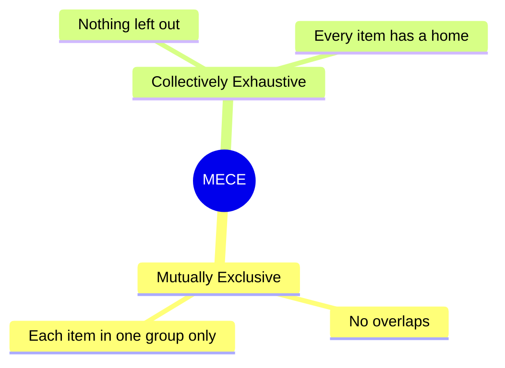

## 🔍 What Is It?

**MECE means splitting a big messy problem into clean groups where nothing overlaps and nothing gets forgotten.**

MECE is a way of organizing things so your groups are perfectly clean. It stands for two ideas: Mutually Exclusive (no overlaps — each item belongs to exactly one group) and Collectively Exhaustive (no gaps — every single item ends up in some group). Together those two rules make sure your thinking covers the whole picture without any duplication.
Imagine sorting your Halloween candy into piles: chocolate, gummies, hard candy, and everything else. A Kit-Kat goes only in the chocolate pile — not gummies too. And you do not stop until every single piece is off the table. That is exactly what MECE asks you to do with any big question.
Grown-ups — especially consultants, who are people hired to help businesses fix their problems — use MECE to break down questions like 'Why are our profits falling?' Clean groups mean no one does the same work twice and no cause gets missed. It turns a fuzzy cloud of worries into a clear, checkable list.

## 🧸 Think Of It Like This

**The Halloween Candy Sort**

You get home from trick-or-treating and dump everything onto the kitchen table. You decide to sort it into four piles: chocolate bars, gummies, hard candy, and everything else. A Kit-Kat goes in the chocolate pile only — it cannot sit in two piles at once. That is the first rule: no overlaps. You keep sorting until every single piece is in a pile and nothing is left on the table. That is the second rule: nothing left out. Now you can see exactly what you have and make smart trades with your sibling. MECE does the exact same thing with big grown-up problems.

## 🖼️ Picture It

<svg viewBox="0 0 600 320" xmlns="http://www.w3.org/2000/svg" font-family="sans-serif"><text x="300" y="26" text-anchor="middle" font-size="15" font-weight="bold" fill="#1e293b">MECE: Two Simple Rules for Sorting</text><rect x="200" y="38" width="200" height="44" rx="8" fill="#dbeafe" stroke="#2563eb" stroke-width="2"/><text x="300" y="65" text-anchor="middle" font-size="14" fill="#1e40af">All Your Candy</text><line x1="300" y1="82" x2="300" y2="106" stroke="#64748b" stroke-width="2"/><line x1="300" y1="106" x2="75" y2="128" stroke="#64748b" stroke-width="2"/><line x1="300" y1="106" x2="205" y2="128" stroke="#64748b" stroke-width="2"/><line x1="300" y1="106" x2="395" y2="128" stroke="#64748b" stroke-width="2"/><line x1="300" y1="106" x2="525" y2="128" stroke="#64748b" stroke-width="2"/><rect x="15" y="128" width="120" height="48" rx="8" fill="#dcfce7" stroke="#16a34a" stroke-width="2"/><text x="75" y="157" text-anchor="middle" font-size="13" fill="#15803d">Chocolate</text><rect x="145" y="128" width="120" height="48" rx="8" fill="#fef9c3" stroke="#ca8a04" stroke-width="2"/><text x="205" y="157" text-anchor="middle" font-size="13" fill="#854d0e">Gummies</text><rect x="335" y="128" width="120" height="48" rx="8" fill="#fee2e2" stroke="#ef4444" stroke-width="2"/><text x="395" y="157" text-anchor="middle" font-size="13" fill="#b91c1c">Hard Candy</text><rect x="465" y="128" width="120" height="48" rx="8" fill="#f1f5f9" stroke="#64748b" stroke-width="2"/><text x="525" y="157" text-anchor="middle" font-size="13" fill="#475569">Other</text><rect x="40" y="208" width="230" height="74" rx="8" fill="#eff6ff" stroke="#2563eb" stroke-width="2" stroke-dasharray="6,3"/><text x="155" y="232" text-anchor="middle" font-size="13" font-weight="bold" fill="#2563eb">Rule 1: No Overlaps</text><text x="155" y="252" text-anchor="middle" font-size="12" fill="#1e293b">Each candy goes in</text><text x="155" y="269" text-anchor="middle" font-size="12" fill="#1e293b">exactly ONE pile</text><rect x="330" y="208" width="230" height="74" rx="8" fill="#f0fdf4" stroke="#16a34a" stroke-width="2" stroke-dasharray="6,3"/><text x="445" y="232" text-anchor="middle" font-size="13" font-weight="bold" fill="#16a34a">Rule 2: Nothing Left Out</text><text x="445" y="252" text-anchor="middle" font-size="12" fill="#1e293b">Every candy ends up</text><text x="445" y="269" text-anchor="middle" font-size="12" fill="#1e293b">in some pile</text></svg>

## 🔀 How It Breaks Down

## 🌍 Real World Example

A consultant helping a coffee shop chain find out why profits are falling uses MECE to map out every possible cause. They split all possible reasons into four groups: costs are too high, sales revenue is too low, operations are wasteful, and outside market conditions have shifted. Every possible reason fits into exactly one group, and together the groups cover every possibility — so the team can dig into each area fully without accidentally checking the same thing twice.

<svg viewBox="0 0 600 320" xmlns="http://www.w3.org/2000/svg" font-family="sans-serif"><text x="300" y="24" text-anchor="middle" font-size="15" font-weight="bold" fill="#1e293b">Why Are Coffee Shop Profits Falling?</text><rect x="175" y="36" width="250" height="54" rx="8" fill="#dbeafe" stroke="#2563eb" stroke-width="2"/><text x="300" y="58" text-anchor="middle" font-size="13" font-weight="bold" fill="#1e40af">All Possible Reasons</text><text x="300" y="77" text-anchor="middle" font-size="12" fill="#1e40af">(must cover everything)</text><line x1="300" y1="90" x2="300" y2="112" stroke="#64748b" stroke-width="2"/><line x1="300" y1="112" x2="75" y2="134" stroke="#64748b" stroke-width="2"/><line x1="300" y1="112" x2="210" y2="134" stroke="#64748b" stroke-width="2"/><line x1="300" y1="112" x2="390" y2="134" stroke="#64748b" stroke-width="2"/><line x1="300" y1="112" x2="525" y2="134" stroke="#64748b" stroke-width="2"/><rect x="15" y="134" width="120" height="60" rx="8" fill="#fee2e2" stroke="#ef4444" stroke-width="2"/><text x="75" y="159" text-anchor="middle" font-size="12" font-weight="bold" fill="#b91c1c">Costs</text><text x="75" y="177" text-anchor="middle" font-size="11" fill="#b91c1c">Too high?</text><rect x="145" y="134" width="130" height="60" rx="8" fill="#dcfce7" stroke="#16a34a" stroke-width="2"/><text x="210" y="159" text-anchor="middle" font-size="12" font-weight="bold" fill="#15803d">Revenue</text><text x="210" y="177" text-anchor="middle" font-size="11" fill="#15803d">Too low?</text><rect x="325" y="134" width="130" height="60" rx="8" fill="#fef9c3" stroke="#ca8a04" stroke-width="2"/><text x="390" y="159" text-anchor="middle" font-size="12" font-weight="bold" fill="#854d0e">Operations</text><text x="390" y="177" text-anchor="middle" font-size="11" fill="#854d0e">Wasteful?</text><rect x="465" y="134" width="120" height="60" rx="8" fill="#f1f5f9" stroke="#64748b" stroke-width="2"/><text x="525" y="159" text-anchor="middle" font-size="12" font-weight="bold" fill="#475569">Market</text><text x="525" y="177" text-anchor="middle" font-size="11" fill="#475569">Shifted?</text><rect x="40" y="228" width="230" height="62" rx="8" fill="#fef3c7" stroke="#f59e0b" stroke-width="2"/><text x="155" y="252" text-anchor="middle" font-size="12" font-weight="bold" fill="#92400e">No Overlaps</text><text x="155" y="270" text-anchor="middle" font-size="11" fill="#1e293b">Each reason fits one group</text><rect x="330" y="228" width="230" height="62" rx="8" fill="#ede9fe" stroke="#7c3aed" stroke-width="2"/><text x="445" y="252" text-anchor="middle" font-size="12" font-weight="bold" fill="#5b21b6">Nothing Left Out</text><text x="445" y="270" text-anchor="middle" font-size="11" fill="#1e293b">All causes are covered</text></svg>

## 🎯 Try It Yourself

List every subject you study at school, then sort them into two or three groups of your choice — then check: does any subject appear in two groups, and is any subject missing from all groups? If both answers are no, you just made a MECE list!
