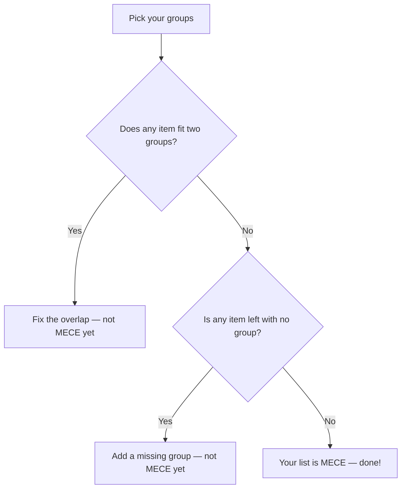

## 🔍 What Is It?

**MECE means sorting things into groups where nothing overlaps and nothing gets left out.**

MECE stands for Mutually Exclusive, Collectively Exhaustive — which sounds fancy but just means two simple rules. Rule one: each thing belongs to exactly one group, never two at once. Rule two: every single thing belongs to some group, nothing gets forgotten.

Grown-ups use it when they tackle big messy problems, like figuring out why a business is losing money or planning a school fundraiser. If your groups overlap, you count the same thing twice and confuse yourself. If your groups have gaps, you miss something important and end up making the wrong call.

Once you build a MECE set of groups, you've seen the full picture — no double-counting, no blind spots. It turns a chaotic pile of ideas into a clean, trustworthy map.

## 🧸 Think Of It Like This

**The Halloween Candy Sort**

Imagine you dump all your Halloween candy on the kitchen table. You sort it into three piles: chocolate, gummies, and hard candy. Every single piece goes into one pile, so nothing is left sitting in the middle unclaimed — that covers everything. No piece fits two piles at the same time, because a Snickers isn't also a gummy bear — so there are zero overlaps. If you made a pile called "sweet things," almost every candy could go there, which makes the sort completely pointless. MECE sorting means your piles are clear, complete, and never step on each other — just like a pro would organize any big problem.

## 🖼️ Picture It

<svg xmlns="http://www.w3.org/2000/svg" viewBox="0 0 600 320" font-family="sans-serif">
  <text x="300" y="24" text-anchor="middle" font-size="15" font-weight="bold" fill="#1e293b">MECE: One Bucket Each, No Piece Left Behind</text>
  <rect x="30" y="38" width="540" height="220" rx="14" fill="#f8fafc" stroke="#64748b" stroke-width="2"/>
  <text x="300" y="60" text-anchor="middle" font-size="12" fill="#64748b">All Your Candy (the whole problem)</text>
  <rect x="50" y="72" width="155" height="160" rx="8" fill="#dbeafe" stroke="#2563eb" stroke-width="2"/>
  <text x="127" y="148" text-anchor="middle" font-size="14" font-weight="bold" fill="#2563eb">Chocolate</text>
  <text x="127" y="168" text-anchor="middle" font-size="11" fill="#2563eb">Snickers, Kit Kat</text>
  <rect x="215" y="72" width="170" height="160" rx="8" fill="#dcfce7" stroke="#16a34a" stroke-width="2"/>
  <text x="300" y="148" text-anchor="middle" font-size="14" font-weight="bold" fill="#16a34a">Gummies</text>
  <text x="300" y="168" text-anchor="middle" font-size="11" fill="#16a34a">Bears, worms</text>
  <rect x="395" y="72" width="155" height="160" rx="8" fill="#fef9c3" stroke="#f59e0b" stroke-width="2"/>
  <text x="472" y="148" text-anchor="middle" font-size="14" font-weight="bold" fill="#b45309">Hard Candy</text>
  <text x="472" y="168" text-anchor="middle" font-size="11" fill="#b45309">Lollipops, mints</text>
  <text x="148" y="285" text-anchor="middle" font-size="12" fill="#16a34a">No overlaps</text>
  <text x="148" y="302" text-anchor="middle" font-size="11" fill="#64748b">(Mutually Exclusive)</text>
  <text x="440" y="285" text-anchor="middle" font-size="12" fill="#16a34a">Nothing left out</text>
  <text x="440" y="302" text-anchor="middle" font-size="11" fill="#64748b">(Collectively Exhaustive)</text>
</svg>

## 🔀 How It Breaks Down

## 🌍 Real World Example

A team helping a restaurant boost sales split all customers into three groups: dine-in, delivery, and pickup. Every customer fit exactly one group, and the three groups together covered everyone — no one was missed, no one was counted twice. This let the team study each group clearly and suggest the right fix for each, rather than guessing at a blurry mix.

## 🎯 Try It Yourself

Take all your school subjects and try to sort them into 3 or 4 groups — maybe by the skills they use — where every subject fits in exactly one group and no subject is left out. Can you find groups that truly work?
