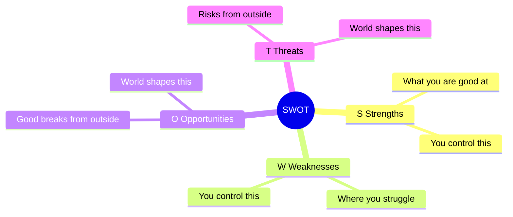

## 🔍 What Is It?

**SWOT is a four-square checklist that makes you ask what you're good at, where you're weak, what lucky chances exist, and what could go wrong — before you decide anything.**

SWOT stands for Strengths, Weaknesses, Opportunities, and Threats. Before making any big decision — starting a club, launching a product, planning a project — people use SWOT to make sure they haven't missed anything obvious. Think of it as turning on all the lights in a room before you rearrange the furniture.
Strengths and Weaknesses are about YOU or your team — the things you actually control right now. Strengths are the skills and resources you already have. Weaknesses are the gaps or problems you need to work around.
Opportunities and Threats come from the world around you — stuff you can't fully control. An Opportunity is a lucky situation or helpful trend you can ride. A Threat is something outside your team that could hurt your plan. Seeing all four together helps you stop guessing and start planning smart.

## 🧸 Think Of It Like This

**The Lemonade Stand Check**

Imagine you want to open a lemonade stand this Saturday. First, Strengths: your grandma taught you a secret recipe and you squeeze lemons really fast. Next, Weaknesses: you only have five dollars for supplies and no table to set up on. Then, Opportunities: there's a huge block party this weekend and the forecast says blazing hot. Finally, Threats: the kid down the street already has a stand, and if it rains your whole day is ruined. Now you can make a real plan — like borrowing a table and setting up near the block party entrance to beat your rival.

## 🖼️ Picture It

<svg viewBox="0 0 600 320" xmlns="http://www.w3.org/2000/svg" font-family="sans-serif">
  <text x="300" y="22" text-anchor="middle" font-size="15" font-weight="bold" fill="#1e293b">SWOT: Four Questions, One Clear Picture</text>
  <text x="170" y="50" text-anchor="middle" font-size="12" fill="#64748b">Inside You (you control)</text>
  <text x="440" y="50" text-anchor="middle" font-size="12" fill="#64748b">Outside World (you don't control)</text>
  <rect x="60" y="60" width="220" height="115" rx="8" fill="#dcfce7" stroke="#16a34a" stroke-width="2"/>
  <text x="170" y="82" text-anchor="middle" font-size="14" font-weight="bold" fill="#16a34a">S — Strengths</text>
  <text x="170" y="102" text-anchor="middle" font-size="11" fill="#1e293b">What are you good at?</text>
  <text x="170" y="120" text-anchor="middle" font-size="11" fill="#1e293b">Secret grandma recipe</text>
  <text x="170" y="138" text-anchor="middle" font-size="11" fill="#1e293b">Fast lemon squeezer</text>
  <rect x="300" y="60" width="240" height="115" rx="8" fill="#fee2e2" stroke="#ef4444" stroke-width="2"/>
  <text x="420" y="82" text-anchor="middle" font-size="14" font-weight="bold" fill="#ef4444">W — Weaknesses</text>
  <text x="420" y="102" text-anchor="middle" font-size="11" fill="#1e293b">Where do you struggle?</text>
  <text x="420" y="120" text-anchor="middle" font-size="11" fill="#1e293b">Only $5 for supplies</text>
  <text x="420" y="138" text-anchor="middle" font-size="11" fill="#1e293b">No table to set up on</text>
  <rect x="60" y="185" width="220" height="115" rx="8" fill="#dbeafe" stroke="#2563eb" stroke-width="2"/>
  <text x="170" y="207" text-anchor="middle" font-size="14" font-weight="bold" fill="#2563eb">O — Opportunities</text>
  <text x="170" y="227" text-anchor="middle" font-size="11" fill="#1e293b">What could help you?</text>
  <text x="170" y="245" text-anchor="middle" font-size="11" fill="#1e293b">Block party this weekend</text>
  <text x="170" y="263" text-anchor="middle" font-size="11" fill="#1e293b">Super hot sunny weather</text>
  <rect x="300" y="185" width="240" height="115" rx="8" fill="#fef3c7" stroke="#f59e0b" stroke-width="2"/>
  <text x="420" y="207" text-anchor="middle" font-size="14" font-weight="bold" fill="#d97706">T — Threats</text>
  <text x="420" y="227" text-anchor="middle" font-size="11" fill="#1e293b">What could go wrong?</text>
  <text x="420" y="245" text-anchor="middle" font-size="11" fill="#1e293b">Rival stand nearby</text>
  <text x="420" y="263" text-anchor="middle" font-size="11" fill="#1e293b">Rain could ruin the day</text>
</svg>

## 🔀 How It Breaks Down

## 🌍 Real World Example

Before the regional championship, a middle-school soccer coach sat the team down for a quick SWOT. They spotted their Strengths (three speedy forwards, rock-solid defense), a key Weakness (the team fades in the second half), an Opportunity (the rival's top scorer was injured), and a Threat (playing on an unfamiliar field after a long bus ride). The coach used this to plan aggressive early attacks and shorter sprint drills to save energy for the full ninety minutes.

<svg viewBox="0 0 600 320" xmlns="http://www.w3.org/2000/svg" font-family="sans-serif">
  <text x="300" y="22" text-anchor="middle" font-size="14" font-weight="bold" fill="#1e293b">Soccer Team SWOT — Regional Championship</text>
  <text x="170" y="50" text-anchor="middle" font-size="12" fill="#64748b">Inside the Team</text>
  <text x="440" y="50" text-anchor="middle" font-size="12" fill="#64748b">Outside the Team</text>
  <rect x="60" y="60" width="220" height="115" rx="8" fill="#dcfce7" stroke="#16a34a" stroke-width="2"/>
  <text x="170" y="82" text-anchor="middle" font-size="13" font-weight="bold" fill="#16a34a">S — Strengths</text>
  <text x="170" y="102" text-anchor="middle" font-size="11" fill="#1e293b">3 speedy forwards</text>
  <text x="170" y="120" text-anchor="middle" font-size="11" fill="#1e293b">Rock-solid defense</text>
  <text x="170" y="138" text-anchor="middle" font-size="11" fill="#1e293b">Great team chemistry</text>
  <rect x="300" y="60" width="240" height="115" rx="8" fill="#fee2e2" stroke="#ef4444" stroke-width="2"/>
  <text x="420" y="82" text-anchor="middle" font-size="13" font-weight="bold" fill="#ef4444">W — Weaknesses</text>
  <text x="420" y="102" text-anchor="middle" font-size="11" fill="#1e293b">Tire out after half-time</text>
  <text x="420" y="120" text-anchor="middle" font-size="11" fill="#1e293b">Weak penalty kicks</text>
  <text x="420" y="138" text-anchor="middle" font-size="11" fill="#1e293b">Backup goalie is new</text>
  <rect x="60" y="185" width="220" height="115" rx="8" fill="#dbeafe" stroke="#2563eb" stroke-width="2"/>
  <text x="170" y="207" text-anchor="middle" font-size="13" font-weight="bold" fill="#2563eb">O — Opportunities</text>
  <text x="170" y="227" text-anchor="middle" font-size="11" fill="#1e293b">Rival's star player injured</text>
  <text x="170" y="245" text-anchor="middle" font-size="11" fill="#1e293b">Two full rest days before</text>
  <text x="170" y="263" text-anchor="middle" font-size="11" fill="#1e293b">Roaring home crowd</text>
  <rect x="300" y="185" width="240" height="115" rx="8" fill="#fef3c7" stroke="#f59e0b" stroke-width="2"/>
  <text x="420" y="207" text-anchor="middle" font-size="13" font-weight="bold" fill="#d97706">T — Threats</text>
  <text x="420" y="227" text-anchor="middle" font-size="11" fill="#1e293b">Unfamiliar away field</text>
  <text x="420" y="245" text-anchor="middle" font-size="11" fill="#1e293b">Opponents score very fast</text>
  <text x="420" y="263" text-anchor="middle" font-size="11" fill="#1e293b">Long bus ride = tired legs</text>
</svg>

## 🎯 Try It Yourself

Pick one goal you have right now — making a sports team, acing an upcoming test, starting a new hobby — and fill in all four squares: What is your biggest Strength? Your biggest Weakness? What Opportunity can you grab this week? What Threat do you need a plan for?
