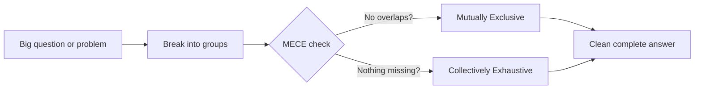

## 🔍 What Is It?

**MECE means splitting a big topic into groups where nothing overlaps and nothing gets forgotten.**

Imagine you have a giant pile of Halloween candy and you want to sort it into boxes. MECE (say it like "me-see") gives you two strict rules. Rule one: no candy can go in two boxes at the same time. Rule two: every single piece must end up in some box — nothing stays on the floor.
Grown-ups use this when solving complicated problems. Before you can fix something, you need to see all the pieces. If two categories overlap, you count things twice and get confused. If you miss a category, you miss part of the answer. MECE makes sure you see the full picture — no blurry edges, no missing corners.
Consultants and managers use MECE all the time when writing reports, organizing data, or breaking a big question into smaller ones they can actually answer. It is like a checklist: are all my groups separate? Does everything fit in one group? If yes to both — you are MECE, and your thinking is clean.

## 🧸 Think Of It Like This

**The Halloween Candy Sort**

It is Halloween night and you dump your entire bag of candy on the kitchen table. You decide to sort it into three boxes: Chocolate, Gummy, and Hard Candy. Rule one — no candy goes into two boxes. A chocolate-covered gummy bear goes in Chocolate, full stop, not Gummy too. Rule two — every single piece must end up somewhere. You cannot leave even one wrapper on the table because you are not sure where it goes. When you are done, all three boxes together hold exactly what was in the bag — not more, not less. That is MECE: split it cleanly, cover it completely.

## 🖼️ Picture It

<svg viewBox="0 0 600 320" xmlns="http://www.w3.org/2000/svg" font-family="sans-serif">
<rect x="0" y="0" width="600" height="320" fill="#f8fafc"/>
<text x="300" y="24" text-anchor="middle" font-size="15" font-weight="bold" fill="#1e293b">MECE: Two Rules for Sorting Candy</text>
<rect x="15" y="38" width="270" height="265" rx="10" fill="#eff6ff" stroke="#2563eb" stroke-width="2"/>
<text x="150" y="62" text-anchor="middle" font-size="13" font-weight="bold" fill="#2563eb">Rule 1 · No Overlaps</text>
<text x="150" y="78" text-anchor="middle" font-size="10" fill="#64748b">(Mutually Exclusive)</text>
<rect x="35" y="90" width="95" height="40" rx="8" fill="#fef3c7" stroke="#f59e0b" stroke-width="2"/>
<text x="82" y="115" text-anchor="middle" font-size="11" fill="#92400e">Chocolate</text>
<rect x="165" y="90" width="95" height="40" rx="8" fill="#dcfce7" stroke="#16a34a" stroke-width="2"/>
<text x="212" y="115" text-anchor="middle" font-size="11" fill="#166534">Gummy</text>
<rect x="35" y="150" width="225" height="40" rx="8" fill="#fee2e2" stroke="#ef4444" stroke-width="2"/>
<text x="147" y="175" text-anchor="middle" font-size="11" fill="#991b1b">Hard Candy</text>
<line x1="130" y1="110" x2="165" y2="110" stroke="#ef4444" stroke-width="2.5" stroke-dasharray="5"/>
<text x="147" y="135" text-anchor="middle" font-size="9" fill="#ef4444">← no overlap →</text>
<text x="150" y="215" text-anchor="middle" font-size="10" fill="#64748b">Each candy goes in ONE box only</text>
<rect x="315" y="38" width="270" height="265" rx="10" fill="#f0fdf4" stroke="#16a34a" stroke-width="2"/>
<text x="450" y="62" text-anchor="middle" font-size="13" font-weight="bold" fill="#16a34a">Rule 2 · No Gaps</text>
<text x="450" y="78" text-anchor="middle" font-size="10" fill="#64748b">(Collectively Exhaustive)</text>
<rect x="335" y="90" width="230" height="120" rx="8" fill="#ffffff" stroke="#16a34a" stroke-width="1.5" stroke-dasharray="5"/>
<text x="450" y="110" text-anchor="middle" font-size="10" fill="#166534">All candy sorted:</text>
<circle cx="385" cy="155" r="22" fill="#fef3c7" stroke="#f59e0b" stroke-width="2"/>
<text x="385" y="159" text-anchor="middle" font-size="9" fill="#92400e">Choc</text>
<circle cx="450" cy="155" r="22" fill="#dcfce7" stroke="#16a34a" stroke-width="2"/>
<text x="450" y="159" text-anchor="middle" font-size="9" fill="#166534">Gummy</text>
<circle cx="515" cy="155" r="22" fill="#fee2e2" stroke="#ef4444" stroke-width="2"/>
<text x="515" y="159" text-anchor="middle" font-size="9" fill="#991b1b">Hard</text>
<text x="450" y="215" text-anchor="middle" font-size="10" fill="#64748b">No candy left on the floor!</text>
<text x="450" y="230" text-anchor="middle" font-size="10" fill="#64748b">Every piece has a home</text>
<text x="300" y="308" text-anchor="middle" font-size="12" font-weight="bold" fill="#1e293b">Together: every item in exactly one group → MECE ✓</text>
</svg>

## 🔀 How It Breaks Down

## 🌍 Real World Example

A phone company wants to design the right plan for every possible customer. They split all customers into four age groups: Kids under 13, Teens aged 13 to 17, Adults aged 18 to 64, and Seniors aged 65 and up. No customer falls into two groups at once (no overlap), and every customer on Earth fits into one of those four groups (no gaps). Now the company can build one perfectly fitted plan for each group without ignoring anyone or creating confusing duplicates.

<svg viewBox="0 0 600 320" xmlns="http://www.w3.org/2000/svg" font-family="sans-serif">
<rect x="0" y="0" width="600" height="320" fill="#f8fafc"/>
<text x="300" y="22" text-anchor="middle" font-size="14" font-weight="bold" fill="#1e293b">Phone Company: MECE Customer Segments</text>
<rect x="15" y="38" width="130" height="115" rx="10" fill="#eff6ff" stroke="#2563eb" stroke-width="2"/>
<text x="80" y="63" text-anchor="middle" font-size="12" font-weight="bold" fill="#2563eb">Kids</text>
<text x="80" y="80" text-anchor="middle" font-size="10" fill="#64748b">Under 13</text>
<text x="80" y="96" text-anchor="middle" font-size="10" fill="#64748b">Basic plans</text>
<text x="80" y="112" text-anchor="middle" font-size="10" fill="#64748b">parental controls</text>
<rect x="160" y="38" width="130" height="115" rx="10" fill="#fef3c7" stroke="#f59e0b" stroke-width="2"/>
<text x="225" y="63" text-anchor="middle" font-size="12" font-weight="bold" fill="#b45309">Teens</text>
<text x="225" y="80" text-anchor="middle" font-size="10" fill="#64748b">Ages 13-17</text>
<text x="225" y="96" text-anchor="middle" font-size="10" fill="#64748b">Big data bundles</text>
<text x="225" y="112" text-anchor="middle" font-size="10" fill="#64748b">social apps</text>
<rect x="305" y="38" width="130" height="115" rx="10" fill="#dcfce7" stroke="#16a34a" stroke-width="2"/>
<text x="370" y="63" text-anchor="middle" font-size="12" font-weight="bold" fill="#166534">Adults</text>
<text x="370" y="80" text-anchor="middle" font-size="10" fill="#64748b">Ages 18-64</text>
<text x="370" y="96" text-anchor="middle" font-size="10" fill="#64748b">Work + family</text>
<text x="370" y="112" text-anchor="middle" font-size="10" fill="#64748b">premium plans</text>
<rect x="450" y="38" width="130" height="115" rx="10" fill="#fee2e2" stroke="#ef4444" stroke-width="2"/>
<text x="515" y="63" text-anchor="middle" font-size="12" font-weight="bold" fill="#991b1b">Seniors</text>
<text x="515" y="80" text-anchor="middle" font-size="10" fill="#64748b">Ages 65+</text>
<text x="515" y="96" text-anchor="middle" font-size="10" fill="#64748b">Simple plans</text>
<text x="515" y="112" text-anchor="middle" font-size="10" fill="#64748b">large-text screen</text>
<line x1="15" y1="178" x2="580" y2="178" stroke="#64748b" stroke-width="2"/>
<line x1="15" y1="173" x2="15" y2="183" stroke="#64748b" stroke-width="2"/>
<line x1="580" y1="173" x2="580" y2="183" stroke="#64748b" stroke-width="2"/>
<text x="300" y="200" text-anchor="middle" font-size="10" fill="#64748b">ALL customers covered — no one falls in two groups at once</text>
<text x="300" y="225" text-anchor="middle" font-size="11" font-weight="bold" fill="#2563eb">No Overlap: a 16-year-old is ONLY in Teens</text>
<text x="300" y="250" text-anchor="middle" font-size="11" font-weight="bold" fill="#16a34a">No Gaps: every customer fits in exactly one segment</text>
<text x="300" y="282" text-anchor="middle" font-size="12" fill="#1e293b">Result: one perfectly-fitted plan designed for each group</text>
</svg>

## 🎯 Try It Yourself

- AI tools at big tech companies: Microsoft is rolling out AI features across its entire business. Applying MECE means sorting every AI use case into non-overlapping buckets — writing help, coding assistant, data analysis, security screening — so no project gets funded twice and no important use case is accidentally left out of the budget.
- Streaming service split: Disney must decide which shows go on Disney+, Hulu, or ESPN+. A MECE split means every show lands in exactly one service with no duplicates, and every show in the library has a clear home so nothing disappears when licensing deals change.
- Chip shortage triage: During the global semiconductor shortage, chipmakers like TSMC had to decide who gets chips first. A MECE breakdown by industry — cars, smartphones, computers, medical devices — means each scarce chip goes to exactly one priority group and no industry is accidentally double-counted or skipped in the plan.
- Why people skip electric cars: Ford wants to understand every barrier stopping customers from buying an EV. A MECE analysis puts those barriers into clean, non-overlapping groups — price too high, not enough charging stations, worry about driving range, distrust of the brand — so every team tackles exactly one problem and nothing falls through the cracks.
