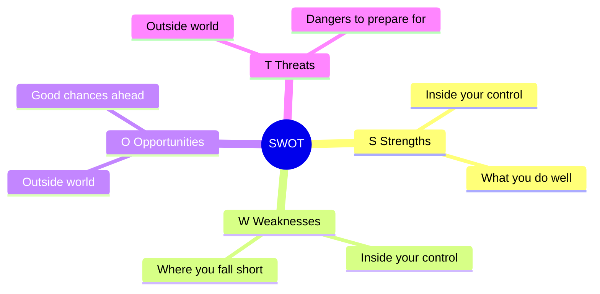

## 🔍 What Is It?

**SWOT is a four-box checklist that shows what you're good at, where you're weak, what chances are out there, and what dangers could trip you up.**

SWOT stands for Strengths, Weaknesses, Opportunities, and Threats. Grown-ups use it before making a big decision — like launching a new product, joining a competition, or changing a plan. You fill in all four boxes and suddenly the whole picture is on one page.

The trick is that S and W are about YOU — things inside your team or business that you can actually change or improve. O and T are about the WORLD AROUND you — things happening outside that you can't fully control, but need to be ready for.

Once all four boxes are full, patterns jump out. Maybe your biggest Strength lines up perfectly with a new Opportunity — that's your move. Or maybe a Weakness makes a Threat extra dangerous — that's what you fix first. SWOT turns a confusing mess into a clear map.

## 🧸 Think Of It Like This

**The Tournament Prep Board**

Imagine your soccer team is deciding whether to enter a big regional tournament. You grab a piece of paper and draw four boxes. In the first box you write your Strengths: lightning-fast players and a goalkeeper who saves everything. In the second box you list your Weaknesses: only nine players on the roster and nobody who can play striker. In the third box you write the Opportunities you see: the trophy is huge, rival teams are weaker this year, and two new kids want to join. In the last box you list the Threats: the number-one ranked team is already signed up, and the entry fee is expensive. Now you can see everything at once — you might decide to recruit a striker and raise money before you sign up, instead of jumping in unprepared.

## 🖼️ Picture It

<svg viewBox="0 0 600 320" xmlns="http://www.w3.org/2000/svg" font-family="sans-serif">
  <rect width="600" height="320" fill="#f8fafc"/>
  <text x="300" y="22" text-anchor="middle" font-size="15" font-weight="bold" fill="#1e293b">SWOT — Your Soccer Team</text>
  <line x1="300" y1="35" x2="300" y2="308" stroke="#64748b" stroke-width="2"/>
  <line x1="58" y1="172" x2="542" y2="172" stroke="#64748b" stroke-width="2"/>
  <text x="179" y="48" text-anchor="middle" font-size="11" fill="#64748b">INSIDE — you control this</text>
  <text x="421" y="48" text-anchor="middle" font-size="11" fill="#64748b">OUTSIDE — world around you</text>
  <rect x="62" y="54" width="228" height="112" rx="8" fill="#dcfce7" stroke="#16a34a" stroke-width="2"/>
  <text x="176" y="74" text-anchor="middle" font-size="13" font-weight="bold" fill="#16a34a">S — Strengths</text>
  <text x="176" y="96" text-anchor="middle" font-size="11" fill="#166534">Fast players</text>
  <text x="176" y="114" text-anchor="middle" font-size="11" fill="#166534">Amazing goalkeeper</text>
  <text x="176" y="132" text-anchor="middle" font-size="11" fill="#166534">Great teamwork</text>
  <text x="176" y="152" text-anchor="middle" font-size="10" fill="#16a34a">What you do well</text>
  <rect x="308" y="54" width="228" height="112" rx="8" fill="#fee2e2" stroke="#ef4444" stroke-width="2"/>
  <text x="422" y="74" text-anchor="middle" font-size="13" font-weight="bold" fill="#ef4444">W — Weaknesses</text>
  <text x="422" y="96" text-anchor="middle" font-size="11" fill="#991b1b">Only 9 players</text>
  <text x="422" y="114" text-anchor="middle" font-size="11" fill="#991b1b">No striker</text>
  <text x="422" y="132" text-anchor="middle" font-size="11" fill="#991b1b">Lose focus when tired</text>
  <text x="422" y="152" text-anchor="middle" font-size="10" fill="#ef4444">Where you struggle</text>
  <rect x="62" y="180" width="228" height="120" rx="8" fill="#dbeafe" stroke="#2563eb" stroke-width="2"/>
  <text x="176" y="200" text-anchor="middle" font-size="13" font-weight="bold" fill="#2563eb">O — Opportunities</text>
  <text x="176" y="220" text-anchor="middle" font-size="11" fill="#1e40af">Big trophy up for grabs</text>
  <text x="176" y="238" text-anchor="middle" font-size="11" fill="#1e40af">Rivals are weaker this year</text>
  <text x="176" y="256" text-anchor="middle" font-size="10" fill="#2563eb">Good chances out there</text>
  <rect x="308" y="180" width="228" height="120" rx="8" fill="#fef3c7" stroke="#f59e0b" stroke-width="2"/>
  <text x="422" y="200" text-anchor="middle" font-size="13" font-weight="bold" fill="#b45309">T — Threats</text>
  <text x="422" y="220" text-anchor="middle" font-size="11" fill="#92400e">Top-ranked team entered</text>
  <text x="422" y="238" text-anchor="middle" font-size="11" fill="#92400e">Entry fee is expensive</text>
  <text x="422" y="256" text-anchor="middle" font-size="10" fill="#b45309">Dangers to watch for</text>
  <text x="28" y="114" text-anchor="middle" font-size="10" fill="#64748b" transform="rotate(-90,28,114)">HELPFUL</text>
  <text x="28" y="244" text-anchor="middle" font-size="10" fill="#64748b" transform="rotate(-90,28,244)">HARMFUL</text>
</svg>

## 🔀 How It Breaks Down

## 🌍 Real World Example

In 2023 the LEGO Group used SWOT thinking to decide whether to invest heavily in digital and augmented-reality (AR) products — meaning apps where you point a phone at a LEGO set and characters come alive on screen. Their Strengths included a beloved global brand and licensing deals with Star Wars and Harry Potter; their Weakness was that their products are very expensive, cutting out many families. The big Opportunity was a fast-growing market for interactive kids' experiences, while the main Threats were cheap rival brick brands and video games pulling children's attention away. The SWOT made the answer clear: double down on unique digital experiences that copycats cannot easily copy.

<svg viewBox="0 0 600 320" xmlns="http://www.w3.org/2000/svg" font-family="sans-serif">
  <rect width="600" height="320" fill="#f8fafc"/>
  <text x="300" y="22" text-anchor="middle" font-size="15" font-weight="bold" fill="#1e293b">SWOT: LEGO Group — Go Digital?</text>
  <line x1="300" y1="35" x2="300" y2="308" stroke="#64748b" stroke-width="2"/>
  <line x1="58" y1="172" x2="542" y2="172" stroke="#64748b" stroke-width="2"/>
  <text x="179" y="48" text-anchor="middle" font-size="11" fill="#64748b">INSIDE — LEGO controls this</text>
  <text x="421" y="48" text-anchor="middle" font-size="11" fill="#64748b">OUTSIDE — market and world</text>
  <rect x="62" y="54" width="228" height="112" rx="8" fill="#dcfce7" stroke="#16a34a" stroke-width="2"/>
  <text x="176" y="74" text-anchor="middle" font-size="13" font-weight="bold" fill="#16a34a">Strengths</text>
  <text x="176" y="96" text-anchor="middle" font-size="11" fill="#166534">Global brand kids love</text>
  <text x="176" y="114" text-anchor="middle" font-size="11" fill="#166534">Star Wars + Harry Potter deals</text>
  <text x="176" y="132" text-anchor="middle" font-size="11" fill="#166534">Huge adult fan community</text>
  <text x="176" y="150" text-anchor="middle" font-size="10" fill="#16a34a">Creativity and education rep</text>
  <rect x="308" y="54" width="228" height="112" rx="8" fill="#fee2e2" stroke="#ef4444" stroke-width="2"/>
  <text x="422" y="74" text-anchor="middle" font-size="13" font-weight="bold" fill="#ef4444">Weaknesses</text>
  <text x="422" y="96" text-anchor="middle" font-size="11" fill="#991b1b">Very expensive to buy</text>
  <text x="422" y="114" text-anchor="middle" font-size="11" fill="#991b1b">Plastic faces eco criticism</text>
  <text x="422" y="132" text-anchor="middle" font-size="11" fill="#991b1b">Sets go out of date fast</text>
  <rect x="62" y="180" width="228" height="120" rx="8" fill="#dbeafe" stroke="#2563eb" stroke-width="2"/>
  <text x="176" y="200" text-anchor="middle" font-size="13" font-weight="bold" fill="#2563eb">Opportunities</text>
  <text x="176" y="220" text-anchor="middle" font-size="11" fill="#1e40af">AR and digital LEGO apps</text>
  <text x="176" y="238" text-anchor="middle" font-size="11" fill="#1e40af">Growing adult collector market</text>
  <text x="176" y="256" text-anchor="middle" font-size="11" fill="#1e40af">New film and TV partnerships</text>
  <rect x="308" y="180" width="228" height="120" rx="8" fill="#fef3c7" stroke="#f59e0b" stroke-width="2"/>
  <text x="422" y="200" text-anchor="middle" font-size="13" font-weight="bold" fill="#b45309">Threats</text>
  <text x="422" y="220" text-anchor="middle" font-size="11" fill="#92400e">Cheap copycat brick brands</text>
  <text x="422" y="238" text-anchor="middle" font-size="11" fill="#92400e">Video games pulling kids away</text>
  <text x="422" y="256" text-anchor="middle" font-size="11" fill="#92400e">Rising plastic and shipping costs</text>
  <text x="28" y="114" text-anchor="middle" font-size="10" fill="#64748b" transform="rotate(-90,28,114)">HELPFUL</text>
  <text x="28" y="244" text-anchor="middle" font-size="10" fill="#64748b" transform="rotate(-90,28,244)">HARMFUL</text>
</svg>

## 🎯 Try It Yourself

- Ford's electric vehicle (EV) line: a SWOT would put existing factories and strong brand trust in Strengths, high battery costs in Weaknesses, government money offered to EV buyers as the Opportunity, and cheaper Chinese EV brands like BYD entering the U.S. market as the biggest Threat.
- OpenAI and ChatGPT: Strengths include a massive user base and a world-class research team; Weaknesses include enormous computing bills that make running the service very costly; the Opportunity is businesses worldwide wanting to buy AI tools to save time; the Threat is new government safety rules that could restrict what the AI is allowed to do.
- Netflix deciding whether to stream live sports: its Strength is 260 million subscribers already on the platform; its Weakness is almost no experience running live events where technical failures are embarrassing and public; the Opportunity is that people are cancelling traditional cable TV yet still want to watch sports; the Threat is that Amazon and Apple are already outbidding rivals for live sports rights.
- TSMC, the company that makes most of the world's advanced computer chips, evaluating new factories in the U.S. and Europe: Strength is unmatched chip-making skill; Weakness is the staggering cost of building new plants; Opportunity is billions in government funding from the U.S. CHIPS Act (a law designed to bring chip-making back to America); Threat is that its main factories sit in Taiwan, near a political flashpoint that could disrupt the global chip supply overnight.
