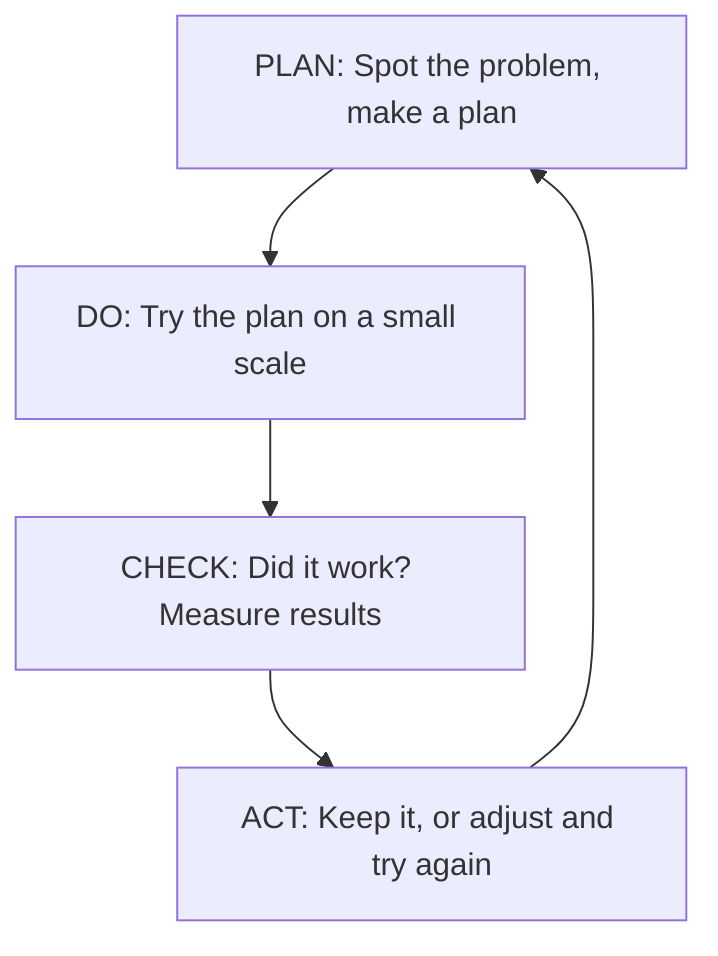

## 🔍 What Is It?

**PDCA is a four-step loop — Plan, Do, Check, Act — where you try a small change, see if it worked, and keep going until things are as good as they can be.**

PDCA stands for Plan, Do, Check, Act. It is a loop grown-ups use when they want to fix a problem or make something better, but they are not totally sure their idea will work. Instead of changing everything at once, they try a small test first.
The loop works like this: you Plan what you want to try, you Do it on a small scale, you Check whether it actually worked by looking at real numbers, and then you Act — either by rolling the change out everywhere, or by tweaking your plan and running the loop again. It is honest about the fact that first tries are rarely perfect.
Grown-ups love PDCA because it stops them from wasting money on a big change that turns out to be a bad idea. Small tests are cheap. If something does not work, you just learned something useful and you try again. Over time, each loop through PDCA leaves things a little better than before.

## 🧸 Think Of It Like This

**The Spelling-Test Practice Loop**

You notice you keep getting the same words wrong on your weekly spelling tests — words with 'ie' or 'ei' in them. So you Plan: instead of just reading the list, you will write each tricky word five times every evening. Next you Do it — you try this new method for one full week. On Friday you get your test back and you Check: did your score go up? It went from 6 out of 10 to 9 out of 10, so yes! Now you Act: you decide to keep using the write-it-five-times method every week from now on. But you also notice you are still missing words with silent letters, so you start the loop again with a brand-new plan just for those — and your scores keep climbing.

## 🖼️ Picture It

<svg viewBox="0 0 600 320" xmlns="http://www.w3.org/2000/svg" font-family="sans-serif">
<defs><marker id="arr" markerWidth="8" markerHeight="8" refX="6" refY="3" orient="auto"><path d="M0,0 L0,6 L8,3 z" fill="#64748b"/></marker></defs>
<rect width="600" height="320" fill="#f8fafc" rx="8"/>
<text x="300" y="26" text-anchor="middle" font-size="15" font-weight="bold" fill="#1e293b">PDCA: The Improvement Loop</text>
<rect x="55" y="55" width="170" height="80" rx="10" fill="#dbeafe" stroke="#2563eb" stroke-width="2.5"/>
<text x="140" y="85" text-anchor="middle" font-size="17" font-weight="bold" fill="#2563eb">PLAN</text>
<text x="140" y="106" text-anchor="middle" font-size="11" fill="#1e40af">Spot the problem</text>
<text x="140" y="122" text-anchor="middle" font-size="11" fill="#1e40af">and make a plan</text>
<rect x="375" y="55" width="170" height="80" rx="10" fill="#dcfce7" stroke="#16a34a" stroke-width="2.5"/>
<text x="460" y="85" text-anchor="middle" font-size="17" font-weight="bold" fill="#16a34a">DO</text>
<text x="460" y="106" text-anchor="middle" font-size="11" fill="#166534">Try the plan</text>
<text x="460" y="122" text-anchor="middle" font-size="11" fill="#166534">on a small scale</text>
<rect x="375" y="185" width="170" height="80" rx="10" fill="#fef3c7" stroke="#f59e0b" stroke-width="2.5"/>
<text x="460" y="215" text-anchor="middle" font-size="17" font-weight="bold" fill="#b45309">CHECK</text>
<text x="460" y="236" text-anchor="middle" font-size="11" fill="#92400e">Did it work?</text>
<text x="460" y="252" text-anchor="middle" font-size="11" fill="#92400e">Measure the results</text>
<rect x="55" y="185" width="170" height="80" rx="10" fill="#fee2e2" stroke="#ef4444" stroke-width="2.5"/>
<text x="140" y="215" text-anchor="middle" font-size="17" font-weight="bold" fill="#ef4444">ACT</text>
<text x="140" y="236" text-anchor="middle" font-size="11" fill="#991b1b">Keep it if it works,</text>
<text x="140" y="252" text-anchor="middle" font-size="11" fill="#991b1b">or adjust and repeat</text>
<line x1="225" y1="95" x2="373" y2="95" stroke="#64748b" stroke-width="2" marker-end="url(#arr)"/>
<line x1="460" y1="137" x2="460" y2="183" stroke="#64748b" stroke-width="2" marker-end="url(#arr)"/>
<line x1="373" y1="225" x2="227" y2="225" stroke="#64748b" stroke-width="2" marker-end="url(#arr)"/>
<line x1="140" y1="183" x2="140" y2="139" stroke="#64748b" stroke-width="2" marker-end="url(#arr)"/>
<text x="300" y="158" text-anchor="middle" font-size="12" fill="#64748b">↺ Repeat forever to keep improving</text>
</svg>

## 🔀 How It Breaks Down

## 🌍 Real World Example

Toyota, the car maker, famously uses PDCA on every factory floor. When workers notice a car part is being fitted incorrectly, they stop the line and Plan a small fix — like changing the angle of a tool. They Do it on the next 100 cars coming off the line, Check whether the error rate dropped, and then Act by updating the official instructions for every factory worldwide if it worked. They run this loop thousands of times a year, which is a big reason their cars are known for being reliable.

<svg viewBox="0 0 600 320" xmlns="http://www.w3.org/2000/svg" font-family="sans-serif">
<defs><marker id="arr2" markerWidth="8" markerHeight="8" refX="6" refY="3" orient="auto"><path d="M0,0 L0,6 L8,3 z" fill="#64748b"/></marker></defs>
<rect width="600" height="320" fill="#f8fafc" rx="8"/>
<text x="300" y="26" text-anchor="middle" font-size="14" font-weight="bold" fill="#1e293b">PDCA at Toyota's Factory Floor</text>
<rect x="55" y="50" width="170" height="90" rx="10" fill="#dbeafe" stroke="#2563eb" stroke-width="2.5"/>
<text x="140" y="74" text-anchor="middle" font-size="14" font-weight="bold" fill="#2563eb">PLAN</text>
<text x="140" y="93" text-anchor="middle" font-size="10" fill="#1e40af">Worker spots a part</text>
<text x="140" y="108" text-anchor="middle" font-size="10" fill="#1e40af">fitted wrong. Idea:</text>
<text x="140" y="123" text-anchor="middle" font-size="10" fill="#1e40af">change tool angle</text>
<rect x="375" y="50" width="170" height="90" rx="10" fill="#dcfce7" stroke="#16a34a" stroke-width="2.5"/>
<text x="460" y="74" text-anchor="middle" font-size="14" font-weight="bold" fill="#16a34a">DO</text>
<text x="460" y="93" text-anchor="middle" font-size="10" fill="#166534">Try the new angle</text>
<text x="460" y="108" text-anchor="middle" font-size="10" fill="#166534">on the next 100 cars</text>
<text x="460" y="123" text-anchor="middle" font-size="10" fill="#166534">off the line</text>
<rect x="375" y="185" width="170" height="90" rx="10" fill="#fef3c7" stroke="#f59e0b" stroke-width="2.5"/>
<text x="460" y="209" text-anchor="middle" font-size="14" font-weight="bold" fill="#b45309">CHECK</text>
<text x="460" y="228" text-anchor="middle" font-size="10" fill="#92400e">Fitting errors: 0 of 100.</text>
<text x="460" y="243" text-anchor="middle" font-size="10" fill="#92400e">Assembly time also down.</text>
<text x="460" y="258" text-anchor="middle" font-size="10" fill="#92400e">The fix works!</text>
<rect x="55" y="185" width="170" height="90" rx="10" fill="#fee2e2" stroke="#ef4444" stroke-width="2.5"/>
<text x="140" y="209" text-anchor="middle" font-size="14" font-weight="bold" fill="#ef4444">ACT</text>
<text x="140" y="228" text-anchor="middle" font-size="10" fill="#991b1b">Update instructions for</text>
<text x="140" y="243" text-anchor="middle" font-size="10" fill="#991b1b">all factories worldwide.</text>
<text x="140" y="258" text-anchor="middle" font-size="10" fill="#991b1b">Find the next problem!</text>
<line x1="225" y1="95" x2="373" y2="95" stroke="#64748b" stroke-width="2" marker-end="url(#arr2)"/>
<line x1="460" y1="142" x2="460" y2="183" stroke="#64748b" stroke-width="2" marker-end="url(#arr2)"/>
<line x1="373" y1="230" x2="227" y2="230" stroke="#64748b" stroke-width="2" marker-end="url(#arr2)"/>
<line x1="140" y1="183" x2="140" y2="142" stroke="#64748b" stroke-width="2" marker-end="url(#arr2)"/>
</svg>

## 🎯 Try It Yourself

- AI tools at companies: Many businesses are rolling out AI assistants but are not sure which tasks they actually help with. A PDCA loop would mean picking one department, running the AI tool there for 30 days (Do), measuring how long tasks took before and after (Check), and then deciding whether to expand to the whole company or try a different tool (Act) — rather than buying expensive licences for everyone before knowing if it works.
- Hospital emergency rooms: Emergency rooms across many countries have dangerously long wait times and no one is sure which fix will work. Using PDCA, one hospital could test a new 'fast-track' lane for minor injuries at a single location for one month (Do), measure average wait times (Check), and only expand the change to all its sites once the numbers prove it helps (Act) — avoiding a costly system-wide rollout that might not work.
- Electric vehicle charging networks: EV charging companies are spending billions but struggle to figure out which locations drivers actually use. PDCA says install chargers in a handful of trial spots — highway rest stops, supermarkets, offices (Do), track how many times per day each one gets used over three months (Check), and use that data to decide which types of locations to build out next (Act) instead of guessing.
- Data privacy compliance: New laws in Europe and the US now require companies to handle customer personal data far more carefully, but companies are unsure how to comply without slowing their websites down. A PDCA loop would apply the new privacy rules to just one type of data — say, email addresses — for 60 days (Do), check whether the site still loads quickly and whether a legal review passes (Check), then roll the same approach out to all customer data (Act).
