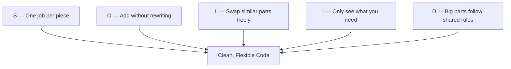

## 🔍 What Is It?

**SOLID is five rules that help programmers write code that is easy to fix, add to, and change without breaking everything else.**

Imagine you built a giant LEGO castle where every piece was glued to every other piece. Change one brick and the whole thing collapses. SOLID is a set of five rules that programmers follow so their code snaps together cleanly — easy to fix, easy to grow, and nothing falls apart when you make a change.
Each letter stands for one rule. S means each piece of code should do exactly one job. O means you can add new features without rewriting the old ones. L means you can swap one similar part for another and everything still works. I means each part only knows what it needs to know. D means the big parts of your program should not depend directly on tiny details — both should follow a shared plan.
Grown-ups use SOLID because software that ignores these rules turns into a tangled mess over time. A small fix in one place breaks five other things. SOLID keeps a whole team's code clean and organized so they can work on it for years without chaos.

## 🧸 Think Of It Like This

**The Perfect LEGO Set Rule**

Imagine you have a huge LEGO set where every type of brick has one clear job — flat plates hold things down, window frames go in walls, hinges open and close. That is the S rule: one piece, one job. The O rule means you can snap a new rocket booster onto your LEGO spaceship without tearing apart the cockpit you already built. The L rule means any standard 2x4 red brick can swap places with a 2x4 blue brick and the wall still stands perfectly. The I rule means the tiny hinge piece does not need to know anything about how the rocket engine works — it only knows how to open and close. The D rule means the base plate does not care exactly which bricks sit on it, as long as they all follow the same standard stud pattern that every LEGO brick uses.

## 🖼️ Picture It

<svg viewBox="0 0 600 320" xmlns="http://www.w3.org/2000/svg" font-family="sans-serif">
  <rect x="20" y="20" width="100" height="118" rx="8" fill="#dbeafe" stroke="#2563eb" stroke-width="2"/>
  <text x="70" y="57" text-anchor="middle" font-size="30" font-weight="bold" fill="#2563eb">S</text>
  <text x="70" y="78" text-anchor="middle" font-size="11" font-weight="bold" fill="#1e40af">Single Job</text>
  <text x="70" y="95" text-anchor="middle" font-size="10" fill="#1e40af">One piece,</text>
  <text x="70" y="111" text-anchor="middle" font-size="10" fill="#1e40af">one purpose</text>
  <rect x="130" y="20" width="100" height="118" rx="8" fill="#dcfce7" stroke="#16a34a" stroke-width="2"/>
  <text x="180" y="57" text-anchor="middle" font-size="30" font-weight="bold" fill="#16a34a">O</text>
  <text x="180" y="78" text-anchor="middle" font-size="11" font-weight="bold" fill="#15803d">Open to Add</text>
  <text x="180" y="95" text-anchor="middle" font-size="10" fill="#15803d">Extend freely,</text>
  <text x="180" y="111" text-anchor="middle" font-size="10" fill="#15803d">don't rewrite</text>
  <rect x="240" y="20" width="100" height="118" rx="8" fill="#fef9c3" stroke="#f59e0b" stroke-width="2"/>
  <text x="290" y="57" text-anchor="middle" font-size="30" font-weight="bold" fill="#d97706">L</text>
  <text x="290" y="78" text-anchor="middle" font-size="11" font-weight="bold" fill="#92400e">Swap Freely</text>
  <text x="290" y="95" text-anchor="middle" font-size="10" fill="#92400e">Similar parts</text>
  <text x="290" y="111" text-anchor="middle" font-size="10" fill="#92400e">are replaceable</text>
  <rect x="350" y="20" width="100" height="118" rx="8" fill="#fee2e2" stroke="#ef4444" stroke-width="2"/>
  <text x="400" y="57" text-anchor="middle" font-size="30" font-weight="bold" fill="#ef4444">I</text>
  <text x="400" y="78" text-anchor="middle" font-size="11" font-weight="bold" fill="#991b1b">Need to Know</text>
  <text x="400" y="95" text-anchor="middle" font-size="10" fill="#991b1b">Parts only see</text>
  <text x="400" y="111" text-anchor="middle" font-size="10" fill="#991b1b">what they need</text>
  <rect x="460" y="20" width="100" height="118" rx="8" fill="#f1f5f9" stroke="#64748b" stroke-width="2"/>
  <text x="510" y="57" text-anchor="middle" font-size="30" font-weight="bold" fill="#475569">D</text>
  <text x="510" y="78" text-anchor="middle" font-size="11" font-weight="bold" fill="#475569">Shared Rules</text>
  <text x="510" y="95" text-anchor="middle" font-size="10" fill="#475569">Big parts follow</text>
  <text x="510" y="111" text-anchor="middle" font-size="10" fill="#475569">a common plan</text>
  <line x1="300" y1="146" x2="300" y2="200" stroke="#64748b" stroke-width="2"/>
  <polygon points="294,197 300,210 306,197" fill="#64748b"/>
  <rect x="100" y="215" width="400" height="78" rx="10" fill="#f0fdf4" stroke="#16a34a" stroke-width="2"/>
  <text x="300" y="245" text-anchor="middle" font-size="15" font-weight="bold" fill="#15803d">Clean, Flexible Code</text>
  <text x="300" y="265" text-anchor="middle" font-size="11" fill="#166534">Easy to fix  ·  Easy to grow</text>
  <text x="300" y="283" text-anchor="middle" font-size="11" fill="#166534">One change never breaks the rest</text>
</svg>

## 🔀 How It Breaks Down

## 🌍 Real World Example

When a popular shopping app added Apple Pay as a payment option, engineers only had to write one new payment piece — they did not touch the search feature, the shopping cart, or the login system. That was possible because the app was built with SOLID: the payment section had one job, and new payment types could be plugged in without rewriting anything else. The rest of the app kept working perfectly the whole time, and customers noticed nothing except a shiny new payment button.

<svg viewBox="0 0 600 320" xmlns="http://www.w3.org/2000/svg" font-family="sans-serif">
  <text x="300" y="22" text-anchor="middle" font-size="13" font-weight="bold" fill="#1e293b">Shopping App Built with SOLID</text>
  <rect x="20" y="38" width="120" height="68" rx="8" fill="#dbeafe" stroke="#2563eb" stroke-width="2"/>
  <text x="80" y="65" text-anchor="middle" font-size="12" font-weight="bold" fill="#2563eb">User Login</text>
  <text x="80" y="83" text-anchor="middle" font-size="10" fill="#1e40af">One job: sign</text>
  <text x="80" y="98" text-anchor="middle" font-size="10" fill="#1e40af">users in/out</text>
  <rect x="155" y="38" width="115" height="68" rx="8" fill="#dcfce7" stroke="#16a34a" stroke-width="2"/>
  <text x="213" y="65" text-anchor="middle" font-size="12" font-weight="bold" fill="#16a34a">Search</text>
  <text x="213" y="83" text-anchor="middle" font-size="10" fill="#15803d">One job: find</text>
  <text x="213" y="98" text-anchor="middle" font-size="10" fill="#15803d">products</text>
  <rect x="285" y="38" width="115" height="68" rx="8" fill="#fef9c3" stroke="#f59e0b" stroke-width="2"/>
  <text x="343" y="65" text-anchor="middle" font-size="12" font-weight="bold" fill="#d97706">Cart</text>
  <text x="343" y="83" text-anchor="middle" font-size="10" fill="#92400e">One job: hold</text>
  <text x="343" y="98" text-anchor="middle" font-size="10" fill="#92400e">chosen items</text>
  <rect x="415" y="38" width="160" height="68" rx="8" fill="#fee2e2" stroke="#ef4444" stroke-width="2"/>
  <text x="495" y="62" text-anchor="middle" font-size="12" font-weight="bold" fill="#ef4444">Payment</text>
  <text x="495" y="79" text-anchor="middle" font-size="10" fill="#991b1b">Card / PayPal / Apple Pay</text>
  <text x="495" y="96" text-anchor="middle" font-size="10" fill="#dc2626">added — nothing else touched</text>
  <line x1="80" y1="106" x2="80" y2="152" stroke="#94a3b8" stroke-width="1.5"/>
  <line x1="213" y1="106" x2="213" y2="152" stroke="#94a3b8" stroke-width="1.5"/>
  <line x1="343" y1="106" x2="343" y2="152" stroke="#94a3b8" stroke-width="1.5"/>
  <line x1="495" y1="106" x2="495" y2="152" stroke="#94a3b8" stroke-width="1.5"/>
  <rect x="30" y="152" width="540" height="52" rx="10" fill="#f1f5f9" stroke="#64748b" stroke-width="2"/>
  <text x="300" y="175" text-anchor="middle" font-size="13" font-weight="bold" fill="#475569">App Core — Shared Rules Everyone Follows</text>
  <text x="300" y="195" text-anchor="middle" font-size="10" fill="#64748b">Modules snap in and out · One change never breaks the others</text>
  <rect x="355" y="225" width="220" height="78" rx="6" fill="#fef3c7" stroke="#f59e0b" stroke-width="2" stroke-dasharray="5,3"/>
  <text x="465" y="247" text-anchor="middle" font-size="11" font-weight="bold" fill="#92400e">Apple Pay added later</text>
  <text x="465" y="265" text-anchor="middle" font-size="10" fill="#92400e">Only Payment box changed.</text>
  <text x="465" y="281" text-anchor="middle" font-size="10" fill="#92400e">Login, Search, Cart:</text>
  <text x="465" y="297" text-anchor="middle" font-size="10" fill="#92400e">completely untouched.</text>
  <line x1="495" y1="204" x2="465" y2="225" stroke="#f59e0b" stroke-width="1.5" stroke-dasharray="4,2"/>
</svg>

## 🎯 Try It Yourself

- AI assistants in office software: Companies like Microsoft are adding AI writing helpers into Word and Outlook. Teams that built these apps with SOLID can plug the AI in as one new separate piece — its only job is suggesting text — without rewriting the document-saving, spell-check, or file-sharing tools that already exist.
- Hospital records switchover: Hundreds of US hospitals are being required by law to upgrade their patient-records software. Hospitals whose old systems were built with SOLID can swap out just the data-storage part, leaving appointment scheduling and billing tools untouched — saving months of risky and expensive rewrites.
- Electric vehicle software updates: Tesla and other EV makers push battery software improvements over the air to millions of cars. Because each piece of car software has one job and follows SOLID rules, engineers can ship a new charging algorithm without accidentally breaking the navigation screen or the climate controls.
- Streaming platform mergers: When two streaming services combine into one app (as happened with Disney+ and Hulu), engineers must join two separate codebases. Platforms built with SOLID have clean, separate pieces — video player, user accounts, recommendation engine — making the merge far less painful than apps where all the code is tangled together.
