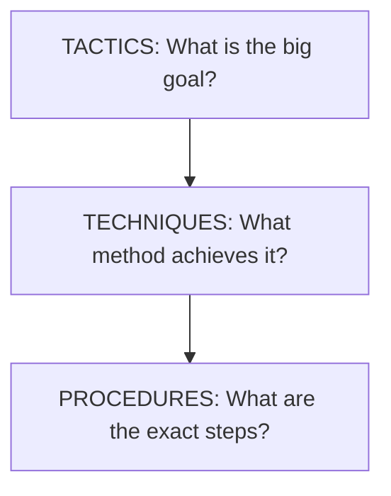

## 🔍 What Is It?

**TTPs breaks down how anyone carries out a plan into three layers — the big goal, the method they pick, and the exact steps they follow.**

TTP stands for Tactics, Techniques, and Procedures. It is a way of describing exactly how someone — usually a hacker, but also a soldier or a criminal — carries out an attack. Instead of just saying a hacker broke in, TTPs let experts write down every layer of the plan: what the attacker was ultimately trying to achieve, which method they chose to get there, and the precise step-by-step moves they made.

Security teams — people whose job is to protect computer networks — use TTPs the way a sports coach uses film of the opposing team. If you know your enemy's TTPs, you can spot their moves early and build a specific defense for each one. Sharing TTPs also lets defenders around the world learn from each other, so when one team discovers a brand-new attack method, everyone else can prepare immediately.

Militaries and police have used this idea for decades, but today it matters most in cybersecurity. A giant public database called MITRE ATT&CK — think of it as an encyclopedia of every known hacker move, organized by TTPs — is used by security teams at companies and governments worldwide. Once you understand TTPs, you understand how the whole field of cybersecurity defense is organized.

## 🧸 Think Of It Like This

**The Soccer Spy Notebook**

Imagine your soccer coach wants to beat the toughest team in the league. She watches hours of their game footage and writes everything down in a notebook. At the top she writes the Tactic: they always try to score by rushing down the left side. Underneath that she writes the Technique: they use fast short passes to slip past defenders. Then at the very bottom she lists every tiny Procedure: player 7 receives the ball at midfield, passes immediately to player 11 who sprints to the corner flag, then crosses low to player 9 waiting at the near post. Now your whole team knows the rival's playbook at every level — the big goal, the method, and the exact footsteps — so you can build a specific counter-move for each one.

## 🖼️ Picture It

<svg viewBox="0 0 600 320" xmlns="http://www.w3.org/2000/svg" font-family="sans-serif">
<defs><marker id="arr" markerWidth="8" markerHeight="8" refX="6" refY="4" orient="auto"><path d="M0,0 L8,4 L0,8 Z" fill="#64748b"/></marker></defs>
<rect width="600" height="320" fill="#f8fafc" rx="12"/>
<text x="300" y="27" text-anchor="middle" font-size="15" font-weight="bold" fill="#1e293b">TTPs: Three Levels of the Plan</text>
<rect x="200" y="38" width="200" height="58" rx="10" fill="#dbeafe" stroke="#2563eb" stroke-width="2.5"/>
<text x="300" y="63" text-anchor="middle" font-size="14" font-weight="bold" fill="#2563eb">TACTICS</text>
<text x="300" y="82" text-anchor="middle" font-size="11" fill="#1e40af">Big Goal: attack down the left side</text>
<line x1="300" y1="96" x2="300" y2="114" stroke="#64748b" stroke-width="2" marker-end="url(#arr)"/>
<rect x="130" y="118" width="340" height="58" rx="10" fill="#dcfce7" stroke="#16a34a" stroke-width="2.5"/>
<text x="300" y="144" text-anchor="middle" font-size="14" font-weight="bold" fill="#16a34a">TECHNIQUES</text>
<text x="300" y="163" text-anchor="middle" font-size="11" fill="#166534">Method: quick passes to slip past defenders</text>
<line x1="300" y1="176" x2="300" y2="194" stroke="#64748b" stroke-width="2" marker-end="url(#arr)"/>
<rect x="50" y="198" width="500" height="78" rx="10" fill="#fef9c3" stroke="#f59e0b" stroke-width="2.5"/>
<text x="300" y="222" text-anchor="middle" font-size="14" font-weight="bold" fill="#b45309">PROCEDURES</text>
<text x="300" y="244" text-anchor="middle" font-size="11" fill="#78350f">Exact Steps: #7 passes to #11 who sprints to corner,</text>
<text x="300" y="261" text-anchor="middle" font-size="11" fill="#78350f">then crosses low to #9 at the near post</text>
<text x="85" y="305" font-size="10" fill="#64748b">General (the big picture)</text>
<text x="400" y="305" font-size="10" fill="#64748b">Specific (tiny steps)</text>
<line x1="210" y1="300" x2="390" y2="300" stroke="#64748b" stroke-width="1" stroke-dasharray="4,3"/>
</svg>

## 🔀 How It Breaks Down

## 🌍 Real World Example

In 2021, a criminal hacker group called DarkSide attacked the Colonial Pipeline — a huge fuel pipeline in the southeastern United States — and forced it to shut down by locking its computer systems and demanding money. Cybersecurity investigators used TTPs to map exactly how it happened: the tactic was to extort money, the technique was sneaking in through a stolen employee password, and the procedures detailed every specific command the hackers ran once they were inside. The FBI and a US government cybersecurity agency called CISA then published those TTPs publicly so that companies across America could check whether attackers could use the exact same moves against them and fix the weaknesses before the next attack.

<svg viewBox="0 0 600 320" xmlns="http://www.w3.org/2000/svg" font-family="sans-serif">
<defs><marker id="arr2" markerWidth="8" markerHeight="8" refX="6" refY="4" orient="auto"><path d="M0,0 L8,4 L0,8 Z" fill="#64748b"/></marker></defs>
<rect width="600" height="320" fill="#f8fafc" rx="12"/>
<text x="300" y="22" text-anchor="middle" font-size="13" font-weight="bold" fill="#1e293b">Colonial Pipeline Attack (2021) Mapped as TTPs</text>
<rect x="185" y="33" width="230" height="55" rx="10" fill="#fee2e2" stroke="#ef4444" stroke-width="2.5"/>
<text x="300" y="57" text-anchor="middle" font-size="13" font-weight="bold" fill="#ef4444">TACTIC</text>
<text x="300" y="75" text-anchor="middle" font-size="10" fill="#991b1b">Extort money by locking pipeline computers</text>
<line x1="300" y1="88" x2="300" y2="106" stroke="#64748b" stroke-width="2" marker-end="url(#arr2)"/>
<rect x="110" y="110" width="380" height="55" rx="10" fill="#ffedd5" stroke="#f97316" stroke-width="2.5"/>
<text x="300" y="135" text-anchor="middle" font-size="13" font-weight="bold" fill="#c2410c">TECHNIQUE</text>
<text x="300" y="153" text-anchor="middle" font-size="10" fill="#7c2d12">Break in using a stolen employee password</text>
<line x1="300" y1="165" x2="300" y2="183" stroke="#64748b" stroke-width="2" marker-end="url(#arr2)"/>
<rect x="35" y="187" width="530" height="97" rx="10" fill="#fef9c3" stroke="#ca8a04" stroke-width="2.5"/>
<text x="300" y="210" text-anchor="middle" font-size="13" font-weight="bold" fill="#854d0e">PROCEDURES</text>
<text x="300" y="229" text-anchor="middle" font-size="10" fill="#713f12">1. Buy the stolen password from an underground online market</text>
<text x="300" y="246" text-anchor="middle" font-size="10" fill="#713f12">2. Log into company remote-access system using that password</text>
<text x="300" y="263" text-anchor="middle" font-size="10" fill="#713f12">3. Spread file-locking software silently across the network</text>
<text x="300" y="280" text-anchor="middle" font-size="10" fill="#713f12">4. Encrypt all files and display ransom note demanding Bitcoin</text>
<text x="300" y="312" text-anchor="middle" font-size="9" fill="#64748b">FBI and CISA published these exact TTPs so other companies could find and close the same gaps</text>
</svg>

## 🎯 Try It Yourself

- AI companies like OpenAI and Google are seeing attacks where criminals try to trick AI assistants into ignoring their safety rules — a method called prompt injection, where hidden instructions are disguised as normal text. Mapping these attacks as TTPs helps AI safety teams catalog every known method and build filters that recognize the early steps of an attack before the AI does something harmful.
- Hospital networks across the US keep getting hit by criminal groups using ransomware — software that locks all your files until you pay money. Health regulators now push hospitals to share TTP reports with each other: if one hospital discovers attackers got in by exploiting a specific remote-login tool, every other hospital can immediately check whether that same tool is unprotected in their own network and patch it.
- Social media companies like Meta and X fight coordinated fake-account campaigns that try to spread false stories before elections. Writing those campaigns down as TTPs — tactic: create public confusion; technique: flood trending topics; procedure: post hundreds of identical phrases within one hour — lets platform engineers build automated systems that detect the pattern and remove the accounts before the false story spreads widely.
- Car manufacturers like Toyota and GM depend on hundreds of small suppliers for computer chips and software. Hackers target the weakest supplier to sneak malicious code into car software before it ships to customers. Sharing TTPs across the whole auto industry means every supplier knows which exact login systems and software tools hackers are targeting right now, so they can fix those weaknesses before the attack reaches a major carmaker.
