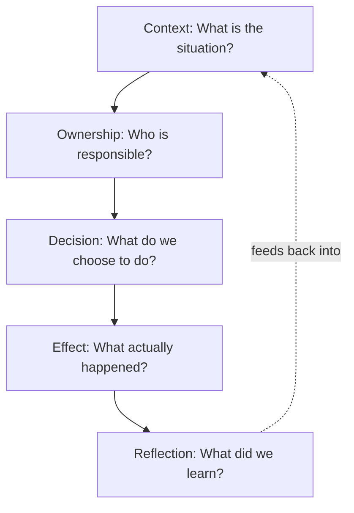

## 🔍 What Is It?

**It's a five-step thinking loop that helps you understand what's going on, decide what to do, see what happens, and get a little smarter every time you repeat it.**

CODER is a five-step thinking tool that grown-ups use whenever they face a problem, make a decision, or run a project. Each letter stands for one question you answer in order: What is the situation? Who is responsible? What are we going to do? What happened when we did it? What did we learn? Working through them in order stops people from jumping straight to solutions before they even understand the problem.
The first two steps — Context and Ownership — are all about setting up clearly before anyone acts. Context means reading the room: what is already true, what is missing, and why this matters right now. Ownership means naming who is in charge of each piece, so nothing slips and nobody can say "I thought they were handling that."
The last step, Reflection, is what turns CODER from a simple checklist into a loop. After you see the Effect of your decision, you sit down honestly and ask: what worked, what did not, and what would we change? That answer becomes the new Context at the very start of the next cycle, so the team gets a little wiser every single time around.

## 🧸 Think Of It Like This

**The Science Fair Loop**

Your class enters the science fair and your team picks "does salt affect how plants grow?" First you survey what you already know — Context: plants need water and sunlight, and nobody in your group has tried this exact test before. Then you divide the jobs — Ownership: you water the three test pots each day, your friend Priya measures the plants, and Marcus records every number. Next you agree on the plan — Decision: three pots, same sunlight and water, but different amounts of salt, tested over two weeks. The fair day arrives and the data is clear: the saltiest pot grew the shortest, weakest plant — Effect: your results were solid and the judges gave you an honorable mention. On the drive home you all agree — Reflection: next time, start the experiment three weeks earlier so the plants have more time to show a real difference. That lesson is your brand-new Context heading into the next science fair.

## 🖼️ Picture It

<svg viewBox="0 0 600 320" xmlns="http://www.w3.org/2000/svg" font-family="sans-serif">
<defs><marker id="a" markerWidth="8" markerHeight="6" refX="8" refY="3" orient="auto"><polygon points="0 0,8 3,0 6" fill="#64748b"/></marker></defs>
<text x="300" y="28" text-anchor="middle" font-size="17" font-weight="bold" fill="#1e293b">CODER Framework</text>
<rect x="25" y="70" width="82" height="60" rx="8" fill="#dbeafe" stroke="#2563eb" stroke-width="2"/>
<text x="66" y="97" text-anchor="middle" font-size="22" font-weight="bold" fill="#2563eb">C</text>
<text x="66" y="113" text-anchor="middle" font-size="10" fill="#1e40af">Context</text>
<rect x="135" y="70" width="82" height="60" rx="8" fill="#dcfce7" stroke="#16a34a" stroke-width="2"/>
<text x="176" y="97" text-anchor="middle" font-size="22" font-weight="bold" fill="#16a34a">O</text>
<text x="176" y="113" text-anchor="middle" font-size="10" fill="#166534">Ownership</text>
<rect x="245" y="70" width="82" height="60" rx="8" fill="#fef9c3" stroke="#ca8a04" stroke-width="2"/>
<text x="286" y="97" text-anchor="middle" font-size="22" font-weight="bold" fill="#ca8a04">D</text>
<text x="286" y="113" text-anchor="middle" font-size="10" fill="#713f12">Decision</text>
<rect x="355" y="70" width="82" height="60" rx="8" fill="#fee2e2" stroke="#ef4444" stroke-width="2"/>
<text x="396" y="97" text-anchor="middle" font-size="22" font-weight="bold" fill="#ef4444">E</text>
<text x="396" y="113" text-anchor="middle" font-size="10" fill="#991b1b">Effect</text>
<rect x="465" y="70" width="82" height="60" rx="8" fill="#f3e8ff" stroke="#9333ea" stroke-width="2"/>
<text x="506" y="97" text-anchor="middle" font-size="22" font-weight="bold" fill="#9333ea">R</text>
<text x="506" y="113" text-anchor="middle" font-size="10" fill="#6b21a8">Reflection</text>
<line x1="107" y1="100" x2="133" y2="100" stroke="#64748b" stroke-width="2" marker-end="url(#a)"/>
<line x1="217" y1="100" x2="243" y2="100" stroke="#64748b" stroke-width="2" marker-end="url(#a)"/>
<line x1="327" y1="100" x2="353" y2="100" stroke="#64748b" stroke-width="2" marker-end="url(#a)"/>
<line x1="437" y1="100" x2="463" y2="100" stroke="#64748b" stroke-width="2" marker-end="url(#a)"/>
<text x="66" y="148" text-anchor="middle" font-size="9" fill="#475569">What is the situation?</text>
<text x="176" y="148" text-anchor="middle" font-size="9" fill="#475569">Who is responsible?</text>
<text x="286" y="148" text-anchor="middle" font-size="9" fill="#475569">What did we choose?</text>
<text x="396" y="148" text-anchor="middle" font-size="9" fill="#475569">What happened?</text>
<text x="506" y="148" text-anchor="middle" font-size="9" fill="#475569">What did we learn?</text>
<path d="M506,130 Q506,248 286,248 Q66,248 66,130" fill="none" stroke="#9333ea" stroke-width="1.5" stroke-dasharray="5,4" marker-end="url(#a)"/>
<text x="286" y="266" text-anchor="middle" font-size="10" fill="#9333ea">Reflection loops back — the next cycle starts smarter</text>
</svg>

## 🔀 How It Breaks Down

## 🌍 Real World Example

When Netflix launched its cheaper, ad-supported subscription plan in 2022, they worked through exactly this kind of thinking. The Context was clear: subscriber numbers had fallen for the first time in a decade and the company needed a new source of income. Ownership meant the product, advertising-sales, and technology teams each had defined roles in building and launching the new tier. The Decision was a $6.99-per-month plan with commercials, and the Effect was millions of new sign-ups — though some existing users were caught off guard by how many ads appeared per hour. The Reflection afterwards directly shaped how Netflix launched the same plan in new countries: they published clear, upfront details about ad frequency before the launch date.

<svg viewBox="0 0 600 320" xmlns="http://www.w3.org/2000/svg" font-family="sans-serif">
<defs><marker id="b" markerWidth="8" markerHeight="6" refX="8" refY="3" orient="auto"><polygon points="0 0,8 3,0 6" fill="#64748b"/></marker></defs>
<text x="300" y="24" text-anchor="middle" font-size="14" font-weight="bold" fill="#1e293b">Netflix Launches an Ad-Supported Plan</text>
<text x="300" y="40" text-anchor="middle" font-size="10" fill="#64748b">CODER applied to a real business decision</text>
<rect x="10" y="55" width="100" height="85" rx="8" fill="#dbeafe" stroke="#2563eb" stroke-width="2"/>
<text x="60" y="74" text-anchor="middle" font-size="9" font-weight="bold" fill="#2563eb">CONTEXT</text>
<text x="60" y="89" text-anchor="middle" font-size="9" fill="#1e40af">Subscribers</text>
<text x="60" y="102" text-anchor="middle" font-size="9" fill="#1e40af">cancelling;</text>
<text x="60" y="115" text-anchor="middle" font-size="9" fill="#1e40af">costs rising</text>
<rect x="125" y="55" width="100" height="85" rx="8" fill="#dcfce7" stroke="#16a34a" stroke-width="2"/>
<text x="175" y="74" text-anchor="middle" font-size="9" font-weight="bold" fill="#16a34a">OWNERSHIP</text>
<text x="175" y="89" text-anchor="middle" font-size="9" fill="#166534">CEO, product,</text>
<text x="175" y="102" text-anchor="middle" font-size="9" fill="#166534">ad-sales &amp;</text>
<text x="175" y="115" text-anchor="middle" font-size="9" fill="#166534">tech teams</text>
<rect x="240" y="55" width="100" height="85" rx="8" fill="#fef9c3" stroke="#ca8a04" stroke-width="2"/>
<text x="290" y="74" text-anchor="middle" font-size="9" font-weight="bold" fill="#ca8a04">DECISION</text>
<text x="290" y="89" text-anchor="middle" font-size="9" fill="#713f12">Launch $6.99</text>
<text x="290" y="102" text-anchor="middle" font-size="9" fill="#713f12">ad-supported</text>
<text x="290" y="115" text-anchor="middle" font-size="9" fill="#713f12">tier</text>
<rect x="355" y="55" width="100" height="85" rx="8" fill="#fee2e2" stroke="#ef4444" stroke-width="2"/>
<text x="405" y="74" text-anchor="middle" font-size="9" font-weight="bold" fill="#ef4444">EFFECT</text>
<text x="405" y="89" text-anchor="middle" font-size="9" fill="#991b1b">Millions of new</text>
<text x="405" y="102" text-anchor="middle" font-size="9" fill="#991b1b">sign-ups; some</text>
<text x="405" y="115" text-anchor="middle" font-size="9" fill="#991b1b">users confused</text>
<rect x="470" y="55" width="100" height="85" rx="8" fill="#f3e8ff" stroke="#9333ea" stroke-width="2"/>
<text x="520" y="74" text-anchor="middle" font-size="9" font-weight="bold" fill="#9333ea">REFLECTION</text>
<text x="520" y="89" text-anchor="middle" font-size="9" fill="#6b21a8">Be upfront about</text>
<text x="520" y="102" text-anchor="middle" font-size="9" fill="#6b21a8">ad frequency</text>
<text x="520" y="115" text-anchor="middle" font-size="9" fill="#6b21a8">before launch</text>
<line x1="110" y1="97" x2="123" y2="97" stroke="#64748b" stroke-width="2" marker-end="url(#b)"/>
<line x1="225" y1="97" x2="238" y2="97" stroke="#64748b" stroke-width="2" marker-end="url(#b)"/>
<line x1="340" y1="97" x2="353" y2="97" stroke="#64748b" stroke-width="2" marker-end="url(#b)"/>
<line x1="455" y1="97" x2="468" y2="97" stroke="#64748b" stroke-width="2" marker-end="url(#b)"/>
<path d="M520,140 Q520,258 290,258 Q60,258 60,140" fill="none" stroke="#9333ea" stroke-width="1.5" stroke-dasharray="5,4" marker-end="url(#b)"/>
<text x="290" y="276" text-anchor="middle" font-size="9" fill="#9333ea">Lesson applied when rolling out to new countries</text>
</svg>

## 🎯 Try It Yourself

- AI chatbots in banking: When big banks like JPMorgan Chase rolled out AI to handle customer calls, CODER meant first documenting exactly why call centres were overwhelmed (Context), naming which teams — IT, legal, and customer-service management — own each part of the launch (Ownership), picking a specific AI tool and timeline (Decision), tracking whether wait times and error rates actually dropped (Effect), and retraining the AI on the cases it handled badly (Reflection).
- Electric vehicle transition at car makers: Ford and GM are rapidly switching from petrol to electric vehicles; CODER frames new emissions rules and rising fuel costs as the Context, assigns ownership to engineering and dealer-network teams, captures the first-model launch as the Decision, measures whether buyers actually switch as the Effect, and uses feedback from low-sales regions to reflect on price or charging-access barriers before designing the next model.
- Remote-work policy at tech firms: When companies like Amazon announced return-to-office rules, CODER meant being honest about what drove the change (Context — falling collaboration scores), assigning HR and department heads as clear owners, setting a specific hybrid schedule as the Decision, tracking headcount and output scores as the Effect, then surveying workers six months later to reflect on what actually helped before revising the policy again.
- Data-privacy enforcement in social media: As EU regulators have fined companies like Meta for mishandling personal data, CODER maps the context as large penalties and rising public distrust, assigns legal and engineering teams as owners of each fix, documents each change to data handling as the Decision, measures whether enforcement actions decrease as the Effect, and uses any remaining complaints as Reflection to drive the next round of updates.
