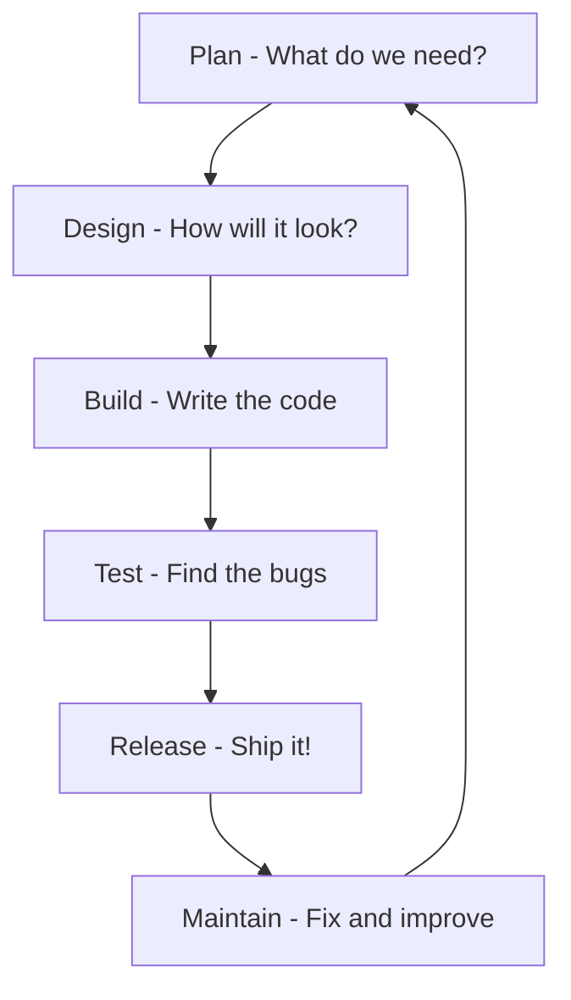

## 🔍 What Is It?

**It's a step-by-step plan that teams follow every time they build a new app or computer program, so nothing gets missed and the final thing actually works.**

SDLC stands for Software Development Life Cycle. It's a recipe that software builders (called developers) follow from the very first idea all the way to when people are actually using the finished program. Just like you wouldn't start baking a cake by randomly throwing ingredients in a bowl, developers don't just start typing code and hope for the best.

The cycle has stages: first you figure out what you need to build, then you plan it, then you design it, then you actually build it, then you test it to catch mistakes, and finally you release it for people to use. After that, you keep watching it and fixing any problems that pop up. Each stage feeds into the next one.

Grown-ups use SDLC because building software without a plan wastes a huge amount of money and time. If developers skip the planning stage and just start coding, they often build the wrong thing entirely — like spending two weeks assembling the wrong LEGO set. The SDLC keeps everyone on the same page so the final product does exactly what people need.

## 🧸 Think Of It Like This

**The LEGO Set Build Plan**

Imagine your family buys you a giant 1,000-piece LEGO Millennium Falcon. Before you touch a single brick, you look at the box to understand what you're making — that's the 'figure out what you need' stage. Next you lay all the bags out in order and read the instruction booklet — that's the planning and design stage. Then you actually snap the pieces together step by step — that's the building stage. When you think you're done, you check every panel and make sure the landing gear actually folds up — that's testing. Finally you put it on your shelf for everyone to see and admire — that's the release. If a wing falls off a week later, you fix it — that's the maintenance stage, and then the whole cycle can start again for the next LEGO set.

## 🖼️ Picture It

<svg viewBox="0 0 600 320" xmlns="http://www.w3.org/2000/svg" font-family="sans-serif">
  <rect width="600" height="320" fill="#f8fafc" rx="12"/>
  <text x="300" y="28" text-anchor="middle" font-size="15" font-weight="bold" fill="#1e293b">SDLC — The 6-Stage Loop</text>
  <circle cx="300" cy="165" r="90" fill="none" stroke="#cbd5e1" stroke-width="2" stroke-dasharray="6 4"/>
  <rect x="240" y="50" width="120" height="36" rx="8" fill="#dbeafe" stroke="#2563eb" stroke-width="2"/>
  <text x="300" y="73" text-anchor="middle" font-size="12" fill="#1e40af" font-weight="bold">1. Plan</text>
  <rect x="430" y="105" width="130" height="36" rx="8" fill="#dcfce7" stroke="#16a34a" stroke-width="2"/>
  <text x="495" y="128" text-anchor="middle" font-size="12" fill="#166534" font-weight="bold">2. Design</text>
  <rect x="430" y="205" width="130" height="36" rx="8" fill="#fef9c3" stroke="#ca8a04" stroke-width="2"/>
  <text x="495" y="228" text-anchor="middle" font-size="12" fill="#92400e" font-weight="bold">3. Build</text>
  <rect x="240" y="245" width="120" height="36" rx="8" fill="#fee2e2" stroke="#ef4444" stroke-width="2"/>
  <text x="300" y="268" text-anchor="middle" font-size="12" fill="#991b1b" font-weight="bold">4. Test</text>
  <rect x="42" y="205" width="130" height="36" rx="8" fill="#ede9fe" stroke="#7c3aed" stroke-width="2"/>
  <text x="107" y="228" text-anchor="middle" font-size="12" fill="#4c1d95" font-weight="bold">5. Release</text>
  <rect x="42" y="105" width="130" height="36" rx="8" fill="#ffedd5" stroke="#ea580c" stroke-width="2"/>
  <text x="107" y="128" text-anchor="middle" font-size="12" fill="#7c2d12" font-weight="bold">6. Maintain</text>
  <path d="M300 86 Q390 86 430 118" fill="none" stroke="#64748b" stroke-width="1.5" marker-end="url(#arr)"/>
  <path d="M560 141 Q560 185 560 205" fill="none" stroke="#64748b" stroke-width="1.5" marker-end="url(#arr)"/>
  <path d="M495 241 Q430 265 360 265" fill="none" stroke="#64748b" stroke-width="1.5" marker-end="url(#arr)"/>
  <path d="M240 263 Q170 263 107 241" fill="none" stroke="#64748b" stroke-width="1.5" marker-end="url(#arr)"/>
  <path d="M40 205 Q40 160 40 141" fill="none" stroke="#64748b" stroke-width="1.5" marker-end="url(#arr)"/>
  <path d="M172 118 Q210 90 240 80" fill="none" stroke="#64748b" stroke-width="1.5" marker-end="url(#arr)"/>
  <defs><marker id="arr" markerWidth="8" markerHeight="8" refX="6" refY="3" orient="auto"><path d="M0,0 L0,6 L8,3 z" fill="#64748b"/></marker></defs>
  <text x="300" y="172" text-anchor="middle" font-size="11" fill="#64748b">repeats</text>
  <text x="300" y="188" text-anchor="middle" font-size="11" fill="#64748b">each version</text>
</svg>

## 🔀 How It Breaks Down

## 🌍 Real World Example

When Apple builds a new version of iOS — the software that runs iPhones — they use the SDLC. Engineers first plan which new features users want (like a better camera app), then designers sketch how it will look, then programmers write millions of lines of code, then testers hunt for bugs for months, then Apple releases it to the world every autumn, and then they push small fixes all year long whenever something breaks.

<svg viewBox="0 0 600 320" xmlns="http://www.w3.org/2000/svg" font-family="sans-serif">
  <rect width="600" height="320" fill="#f8fafc" rx="12"/>
  <text x="300" y="26" text-anchor="middle" font-size="14" font-weight="bold" fill="#1e293b">Apple iOS Release — SDLC in Real Life</text>
  <rect x="20" y="50" width="100" height="52" rx="8" fill="#dbeafe" stroke="#2563eb" stroke-width="2"/>
  <text x="70" y="72" text-anchor="middle" font-size="11" font-weight="bold" fill="#1e40af">Plan</text>
  <text x="70" y="89" text-anchor="middle" font-size="10" fill="#1e40af">Survey users,</text>
  <text x="70" y="101" text-anchor="middle" font-size="10" fill="#1e40af">pick features</text>
  <rect x="140" y="50" width="100" height="52" rx="8" fill="#dcfce7" stroke="#16a34a" stroke-width="2"/>
  <text x="190" y="72" text-anchor="middle" font-size="11" font-weight="bold" fill="#166534">Design</text>
  <text x="190" y="89" text-anchor="middle" font-size="10" fill="#166534">Sketch UI,</text>
  <text x="190" y="101" text-anchor="middle" font-size="10" fill="#166534">prototype screens</text>
  <rect x="260" y="50" width="100" height="52" rx="8" fill="#fef9c3" stroke="#ca8a04" stroke-width="2"/>
  <text x="310" y="72" text-anchor="middle" font-size="11" font-weight="bold" fill="#92400e">Build</text>
  <text x="310" y="89" text-anchor="middle" font-size="10" fill="#92400e">Engineers write</text>
  <text x="310" y="101" text-anchor="middle" font-size="10" fill="#92400e">millions of lines</text>
  <rect x="380" y="50" width="100" height="52" rx="8" fill="#fee2e2" stroke="#ef4444" stroke-width="2"/>
  <text x="430" y="72" text-anchor="middle" font-size="11" font-weight="bold" fill="#991b1b">Test</text>
  <text x="430" y="89" text-anchor="middle" font-size="10" fill="#991b1b">Beta testers find</text>
  <text x="430" y="101" text-anchor="middle" font-size="10" fill="#991b1b">bugs for months</text>
  <rect x="500" y="50" width="82" height="52" rx="8" fill="#ede9fe" stroke="#7c3aed" stroke-width="2"/>
  <text x="541" y="72" text-anchor="middle" font-size="11" font-weight="bold" fill="#4c1d95">Release</text>
  <text x="541" y="89" text-anchor="middle" font-size="10" fill="#4c1d95">Ships every</text>
  <text x="541" y="101" text-anchor="middle" font-size="10" fill="#4c1d95">autumn</text>
  <line x1="120" y1="76" x2="140" y2="76" stroke="#64748b" stroke-width="1.5" marker-end="url(#a2)"/>
  <line x1="240" y1="76" x2="260" y2="76" stroke="#64748b" stroke-width="1.5" marker-end="url(#a2)"/>
  <line x1="360" y1="76" x2="380" y2="76" stroke="#64748b" stroke-width="1.5" marker-end="url(#a2)"/>
  <line x1="480" y1="76" x2="500" y2="76" stroke="#64748b" stroke-width="1.5" marker-end="url(#a2)"/>
  <rect x="140" y="170" width="320" height="50" rx="8" fill="#ffedd5" stroke="#ea580c" stroke-width="2"/>
  <text x="300" y="192" text-anchor="middle" font-size="12" font-weight="bold" fill="#7c2d12">Maintain</text>
  <text x="300" y="210" text-anchor="middle" font-size="11" fill="#7c2d12">Monthly iOS updates fix bugs and patch security holes all year long</text>
  <path d="M541 102 Q541 155 460 170" fill="none" stroke="#64748b" stroke-width="1.5" marker-end="url(#a2)"/>
  <path d="M140 195 Q80 195 70 102" fill="none" stroke="#64748b" stroke-width="1.5" marker-end="url(#a2)"/>
  <text x="300" y="256" text-anchor="middle" font-size="11" fill="#64748b">Then the whole cycle starts again for the next iOS version</text>
  <defs><marker id="a2" markerWidth="8" markerHeight="8" refX="6" refY="3" orient="auto"><path d="M0,0 L0,6 L8,3 z" fill="#64748b"/></marker></defs>
</svg>

## 🎯 Try It Yourself

- AI chatbot companies like OpenAI are using SDLC right now to build new versions of ChatGPT — they plan which new skills the AI needs, design how users will talk to it, build and train the model, test it for harmful outputs, release it, and then monitor it 24/7 to patch problems that real users discover.
- Car companies like Ford and GM are applying SDLC to build the software inside electric vehicles — they plan the battery management features, design the dashboard screens, write the code, test it in thousands of simulated crashes and weather conditions, release it in new car models, and push over-the-air updates to fix bugs after cars are already on the road.
- Hospital networks building new patient apps use SDLC to make sure the software is safe and follows privacy laws — the planning stage alone takes months because one coding mistake could show the wrong medicine dosage to a nurse, so testing is especially long and strict before anything goes live.
- Video game studios like Activision follow SDLC when making a new Call of Duty — they plan the story and game modes, designers build the levels, programmers code the engine, testers play it for months hunting for glitches, then it launches globally, and patches keep rolling out every few weeks to fix cheating exploits players find.
