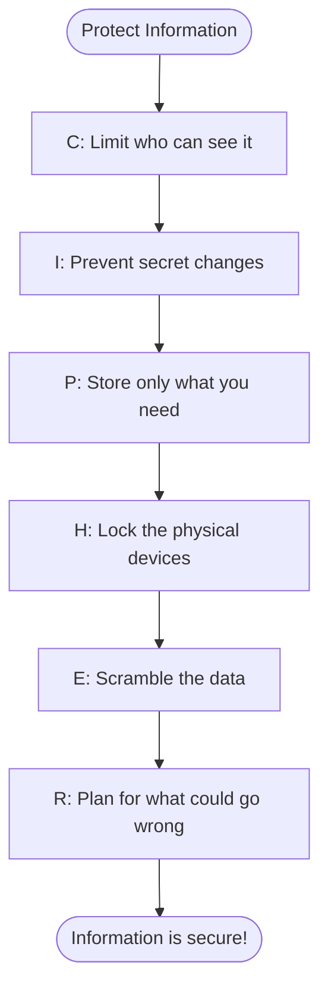

## 🔍 What Is It?

**CIPHER is a six-part checklist security experts use to make sure information is protected from every possible angle.**

Security experts need to protect information — passwords, health records, private messages. But information can be threatened in many different ways at once. CIPHER gives them a checklist of six things to verify, so they never accidentally leave a door open.

The six parts are: Confidentiality (only the right people can see the data), Integrity (no one can secretly alter it), Privacy (keep personal details to a minimum), Hardware security (the actual physical machines are locked), Encryption (data is scrambled into a code so only authorized people can unscramble it), and Risk management (think ahead about what attacks could happen and have a plan ready). Each one plugs a different hole.

Organizations — schools, hospitals, banks, tech companies — run through CIPHER the way a pilot runs a pre-flight checklist. Miss one item and you leave a gap someone could take advantage of. Cover all six and you have real, solid protection.

## 🧸 Think Of It Like This

**The Secret Diary Checklist**

Imagine you have a diary full of your deepest secrets. Confidentiality means only you can read it, so you hide it somewhere only you know. Integrity means no one can sneak in and change what you wrote — you would notice immediately if a page was messed with. Privacy means you write your thoughts but never your home address, so personal details stay off the page. Hardware means you store the diary in a locked metal box, not just under a pillow, so it cannot be physically grabbed. Encryption means some entries are written in a secret code only you understand, so even if someone steals the diary they cannot read a word. Risk means you ask yourself 'what if my little sibling finds the box key?' and hide a spare somewhere else — that is planning ahead for danger.

## 🖼️ Picture It

<svg viewBox="0 0 600 320" xmlns="http://www.w3.org/2000/svg" font-family="sans-serif">
  <rect width="600" height="320" fill="#f8fafc" rx="10"/>
  <text x="300" y="28" text-anchor="middle" font-size="16" font-weight="bold" fill="#1e293b">CIPHER: 6 Security Checkpoints</text>
  <text x="300" y="48" text-anchor="middle" font-size="11" fill="#64748b">Check all six — miss one and you leave a gap</text>
  <rect x="15" y="60" width="170" height="75" rx="8" fill="#dbeafe" stroke="#2563eb" stroke-width="2"/>
  <text x="35" y="86" font-size="20" font-weight="bold" fill="#2563eb">C</text>
  <text x="57" y="86" font-size="12" font-weight="bold" fill="#1e3a8a">Confidentiality</text>
  <text x="22" y="105" font-size="10" fill="#1e3a8a">Only right people</text>
  <text x="22" y="120" font-size="10" fill="#1e3a8a">can see the data</text>
  <rect x="215" y="60" width="170" height="75" rx="8" fill="#dcfce7" stroke="#16a34a" stroke-width="2"/>
  <text x="235" y="86" font-size="20" font-weight="bold" fill="#16a34a">I</text>
  <text x="253" y="86" font-size="12" font-weight="bold" fill="#14532d">Integrity</text>
  <text x="225" y="105" font-size="10" fill="#14532d">Data cannot be secretly</text>
  <text x="225" y="120" font-size="10" fill="#14532d">changed or tampered with</text>
  <rect x="415" y="60" width="170" height="75" rx="8" fill="#fef9c3" stroke="#ca8a04" stroke-width="2"/>
  <text x="432" y="86" font-size="20" font-weight="bold" fill="#ca8a04">P</text>
  <text x="453" y="86" font-size="12" font-weight="bold" fill="#78350f">Privacy</text>
  <text x="425" y="105" font-size="10" fill="#78350f">Only needed personal</text>
  <text x="425" y="120" font-size="10" fill="#78350f">info is ever stored</text>
  <rect x="15" y="165" width="170" height="75" rx="8" fill="#fee2e2" stroke="#ef4444" stroke-width="2"/>
  <text x="35" y="191" font-size="20" font-weight="bold" fill="#ef4444">H</text>
  <text x="57" y="191" font-size="12" font-weight="bold" fill="#7f1d1d">Hardware</text>
  <text x="22" y="210" font-size="10" fill="#7f1d1d">Physical machines</text>
  <text x="22" y="225" font-size="10" fill="#7f1d1d">are locked and secured</text>
  <rect x="215" y="165" width="170" height="75" rx="8" fill="#ede9fe" stroke="#7c3aed" stroke-width="2"/>
  <text x="235" y="191" font-size="20" font-weight="bold" fill="#7c3aed">E</text>
  <text x="255" y="191" font-size="12" font-weight="bold" fill="#3b0764">Encryption</text>
  <text x="225" y="210" font-size="10" fill="#3b0764">Data is scrambled so</text>
  <text x="225" y="225" font-size="10" fill="#3b0764">only you can read it</text>
  <rect x="415" y="165" width="170" height="75" rx="8" fill="#f1f5f9" stroke="#64748b" stroke-width="2"/>
  <text x="432" y="191" font-size="20" font-weight="bold" fill="#475569">R</text>
  <text x="453" y="191" font-size="12" font-weight="bold" fill="#1e293b">Risk Management</text>
  <text x="425" y="210" font-size="10" fill="#1e293b">Plan for what could</text>
  <text x="425" y="225" font-size="10" fill="#1e293b">go wrong before it does</text>
  <text x="300" y="264" text-anchor="middle" font-size="10" fill="#64748b">All 6 work together — one weak link breaks the whole chain</text>
</svg>

## 🔀 How It Breaks Down

## 🌍 Real World Example

A city hospital uses CIPHER to protect patient medical records. Only logged-in doctors and nurses can open a patient's file (Confidentiality), and every edit is automatically logged so secret changes are impossible (Integrity). The system stores only the medical details it needs — no extra personal info (Privacy). The server room requires a key card and has security cameras on the door (Hardware). All files are scrambled on disk so a stolen hard drive reveals nothing (Encryption). And the IT team runs monthly drills to practice exactly what they would do if hackers got in (Risk).

<svg viewBox="0 0 600 320" xmlns="http://www.w3.org/2000/svg" font-family="sans-serif">
  <rect width="600" height="320" fill="#f8fafc" rx="10"/>
  <text x="300" y="22" text-anchor="middle" font-size="14" font-weight="bold" fill="#1e293b">CIPHER Applied: City Hospital Patient Records</text>
  <rect x="10" y="35" width="140" height="268" rx="8" fill="#dbeafe" stroke="#2563eb" stroke-width="2"/>
  <text x="80" y="58" text-anchor="middle" font-size="11" font-weight="bold" fill="#1e3a8a">City Hospital</text>
  <rect x="50" y="68" width="60" height="60" rx="4" fill="white" stroke="#2563eb" stroke-width="2"/>
  <line x1="80" y1="78" x2="80" y2="118" stroke="#ef4444" stroke-width="5"/>
  <line x1="60" y1="98" x2="100" y2="98" stroke="#ef4444" stroke-width="5"/>
  <text x="80" y="148" text-anchor="middle" font-size="10" fill="#1e3a8a">Patient</text>
  <text x="80" y="163" text-anchor="middle" font-size="10" fill="#1e3a8a">Medical</text>
  <text x="80" y="178" text-anchor="middle" font-size="10" fill="#1e3a8a">Records</text>
  <text x="80" y="205" text-anchor="middle" font-size="9" fill="#64748b">Protected by</text>
  <text x="80" y="223" text-anchor="middle" font-size="16" font-weight="bold" fill="#2563eb">CIPHER</text>
  <rect x="158" y="35" width="432" height="38" rx="6" fill="#dbeafe" stroke="#2563eb" stroke-width="1.5"/>
  <text x="173" y="59" font-size="13" font-weight="bold" fill="#2563eb">C</text>
  <text x="192" y="59" font-size="11" fill="#1e3a8a">Only logged-in doctors and nurses can open a patient's file</text>
  <rect x="158" y="81" width="432" height="38" rx="6" fill="#dcfce7" stroke="#16a34a" stroke-width="1.5"/>
  <text x="173" y="105" font-size="13" font-weight="bold" fill="#16a34a">I</text>
  <text x="192" y="105" font-size="11" fill="#14532d">Every record edit is logged — no secret changes possible</text>
  <rect x="158" y="127" width="432" height="38" rx="6" fill="#fef9c3" stroke="#ca8a04" stroke-width="1.5"/>
  <text x="173" y="151" font-size="13" font-weight="bold" fill="#ca8a04">P</text>
  <text x="192" y="151" font-size="11" fill="#78350f">Only essential medical data is kept — nothing extra stored</text>
  <rect x="158" y="173" width="432" height="38" rx="6" fill="#fee2e2" stroke="#ef4444" stroke-width="1.5"/>
  <text x="173" y="197" font-size="13" font-weight="bold" fill="#ef4444">H</text>
  <text x="192" y="197" font-size="11" fill="#7f1d1d">Server room needs a key card — cameras watch the door 24/7</text>
  <rect x="158" y="219" width="432" height="38" rx="6" fill="#ede9fe" stroke="#7c3aed" stroke-width="1.5"/>
  <text x="173" y="243" font-size="13" font-weight="bold" fill="#7c3aed">E</text>
  <text x="192" y="243" font-size="11" fill="#3b0764">All files are encrypted — a stolen drive reveals nothing</text>
  <rect x="158" y="265" width="432" height="38" rx="6" fill="#f1f5f9" stroke="#64748b" stroke-width="1.5"/>
  <text x="173" y="289" font-size="13" font-weight="bold" fill="#475569">R</text>
  <text x="192" y="289" font-size="11" fill="#1e293b">IT team runs monthly drills to prepare for a cyber attack</text>
</svg>

## 🎯 Try It Yourself

- AI chatbot companies like OpenAI store millions of user conversations: CIPHER pushes them to check who can read those chats (C), whether conversation logs could be secretly altered (I), how little personal data they actually need to keep (P), whether data center servers are physically locked (H), whether all chats are scrambled while stored (E), and what the step-by-step plan is for the day a data breach is discovered (R).
- Car makers rolling out software-controlled electric vehicles collect location and driving data from millions of people: CIPHER helps engineers confirm only authorized staff can see trip routes (C), that the car's software cannot be secretly reprogrammed over the internet (I), that personal data collected is kept to the bare minimum (P), that physical access to the car's onboard computer is locked (H), that all data is scrambled while travelling between car and server (E), and that there is a written plan if a hacker tries to take control of a vehicle remotely (R).
- Retailers like big grocery chains now store millions of customers' loyalty card and payment details in the cloud: CIPHER tells their security team to confirm only certain staff can see card numbers (C), that purchase history records cannot be secretly edited (I), that they delete customer data they no longer need (P), that warehouse servers are behind locked doors (H), that all payment data is scrambled end-to-end (E), and that there is a tested plan for if their checkout systems are attacked (R).
- Banks using AI models to catch credit card fraud process millions of transactions per minute: CIPHER ensures only fraud analysts see the details of flagged cards (C), that the AI's decisions cannot be secretly adjusted to let fraud slip through (I), that only transaction data — not extra personal details — feeds the model (P), that the AI servers sit in secured facilities (H), that all transaction data is encrypted the whole way through (E), and that the bank rehearses its response to a large-scale attack every quarter (R).
