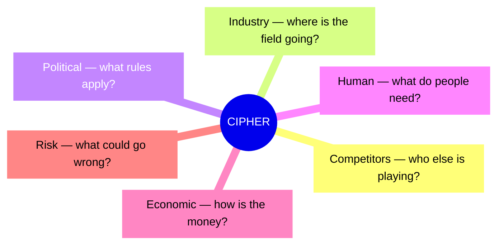

## 🔍 What Is It?

**CIPHER is a six-question checklist that makes sure you understand your whole situation — competitors, industry, rules, people, money, and risks — before making a big decision.**

CIPHER is a tool grown-ups use to scan everything around their business before making a big move. Each letter stands for one angle: Competitors (who else is playing), Industry (where the whole field is heading), Political or Rules (what laws apply), Human factors (what people actually want), Economic conditions (what is happening with money), and Risk (what could go wrong). Together the six lenses stop you from making a plan with a blind spot.
The reason it matters is that most bad decisions happen because someone looked at only one or two things and ignored the rest. A brilliant new product can still fail because a new law banned it, or because nobody could afford it that year. CIPHER is basically a memory trick that makes sure you ask all six questions, not just the ones you like.
Grown-ups in business, government, and sports all fall into the same trap — they fall in love with one idea and forget the other five questions. CIPHER keeps them honest by giving every angle its own letter so nothing gets skipped.

## 🧸 Think Of It Like This

**The School Fair Lemonade Stand**

You are setting up a lemonade stand at the school fair and you want it to be the most popular one there. You count the other drink sellers nearby — those are your Competitors (C) — and you notice that smoothies are trending this summer, which tells you where your whole Industry (I) is heading, so you add a fruit twist to your recipe. You read the school's food-selling rules so you do not get shut down — that is the Political check (P) — and you ask your best friends whether they want sweet or tangy, covering your Human factors (H). You confirm your classmates got their weekly allowance so they have cash to spend (Economic — E), and you peek at the weather app, because a sudden rainstorm would mean zero customers and that is your biggest Risk (R). With all six boxes ticked, your plan is far stronger than just winging it.

## 🖼️ Picture It

<svg viewBox="0 0 600 320" xmlns="http://www.w3.org/2000/svg" font-family="sans-serif">
  <text x="300" y="28" text-anchor="middle" font-size="18" font-weight="bold" fill="#1e293b">CIPHER Framework</text>
  <rect x="20" y="42" width="265" height="68" rx="10" fill="#dbeafe" stroke="#2563eb" stroke-width="2"/>
  <text x="40" y="70" font-size="20" font-weight="bold" fill="#2563eb">C</text>
  <text x="62" y="70" font-size="14" font-weight="bold" fill="#1e293b">Competitors</text>
  <text x="62" y="88" font-size="11" fill="#475569">Who else is in your market?</text>
  <rect x="315" y="42" width="265" height="68" rx="10" fill="#dcfce7" stroke="#16a34a" stroke-width="2"/>
  <text x="335" y="70" font-size="20" font-weight="bold" fill="#16a34a">I</text>
  <text x="357" y="70" font-size="14" font-weight="bold" fill="#1e293b">Industry</text>
  <text x="357" y="88" font-size="11" fill="#475569">Where is the whole field going?</text>
  <rect x="20" y="122" width="265" height="68" rx="10" fill="#fef9c3" stroke="#f59e0b" stroke-width="2"/>
  <text x="40" y="150" font-size="20" font-weight="bold" fill="#d97706">P</text>
  <text x="62" y="150" font-size="14" font-weight="bold" fill="#1e293b">Political / Rules</text>
  <text x="62" y="168" font-size="11" fill="#475569">What laws and rules apply?</text>
  <rect x="315" y="122" width="265" height="68" rx="10" fill="#fee2e2" stroke="#ef4444" stroke-width="2"/>
  <text x="335" y="150" font-size="20" font-weight="bold" fill="#ef4444">H</text>
  <text x="357" y="150" font-size="14" font-weight="bold" fill="#1e293b">Human Factors</text>
  <text x="357" y="168" font-size="11" fill="#475569">What do people want and need?</text>
  <rect x="20" y="202" width="265" height="68" rx="10" fill="#ede9fe" stroke="#7c3aed" stroke-width="2"/>
  <text x="40" y="230" font-size="20" font-weight="bold" fill="#7c3aed">E</text>
  <text x="62" y="230" font-size="14" font-weight="bold" fill="#1e293b">Economic</text>
  <text x="62" y="248" font-size="11" fill="#475569">How is the money environment?</text>
  <rect x="315" y="202" width="265" height="68" rx="10" fill="#f1f5f9" stroke="#64748b" stroke-width="2"/>
  <text x="335" y="230" font-size="20" font-weight="bold" fill="#64748b">R</text>
  <text x="357" y="230" font-size="14" font-weight="bold" fill="#1e293b">Risk</text>
  <text x="357" y="248" font-size="11" fill="#475569">What could go wrong?</text>
</svg>

## 🔀 How It Breaks Down

## 🌍 Real World Example

When Uber was deciding whether to launch in major cities across Southeast Asia, its strategy team ran a CIPHER check. Competitors (C) showed that local ride-hailing apps like Grab already had deep user loyalty; Industry (I) confirmed demand was growing fast; Political (P) flagged strict taxi laws that threatened to block the app; Human (H) revealed that most riders had no credit cards and preferred paying cash; Economic (E) showed lower average incomes meant fares had to be much cheaper than in the US; and Risk (R) highlighted that government bans had already shut down ride-hailing in several nearby cities. This six-lens scan helped Uber decide which markets to enter first and forced it to redesign the app — adding cash payments — before it even launched.

<svg viewBox="0 0 600 320" xmlns="http://www.w3.org/2000/svg" font-family="sans-serif">
  <text x="300" y="22" text-anchor="middle" font-size="14" font-weight="bold" fill="#1e293b">Uber Entering Southeast Asia — CIPHER Analysis</text>
  <rect x="20" y="35" width="265" height="68" rx="8" fill="#dbeafe" stroke="#2563eb" stroke-width="2"/>
  <text x="35" y="58" font-size="13" font-weight="bold" fill="#2563eb">C — Competitors</text>
  <text x="35" y="76" font-size="11" fill="#475569">Grab and local apps already had</text>
  <text x="35" y="91" font-size="11" fill="#475569">strong loyalty across the region</text>
  <rect x="315" y="35" width="265" height="68" rx="8" fill="#dcfce7" stroke="#16a34a" stroke-width="2"/>
  <text x="330" y="58" font-size="13" font-weight="bold" fill="#16a34a">I — Industry</text>
  <text x="330" y="76" font-size="11" fill="#475569">Ride-hailing demand booming;</text>
  <text x="330" y="91" font-size="11" fill="#475569">smartphones spreading fast</text>
  <rect x="20" y="115" width="265" height="68" rx="8" fill="#fef9c3" stroke="#f59e0b" stroke-width="2"/>
  <text x="35" y="138" font-size="13" font-weight="bold" fill="#d97706">P — Political / Rules</text>
  <text x="35" y="156" font-size="11" fill="#475569">Strict taxi laws; some governments</text>
  <text x="35" y="171" font-size="11" fill="#475569">threatening to ban ride-hailing</text>
  <rect x="315" y="115" width="265" height="68" rx="8" fill="#fee2e2" stroke="#ef4444" stroke-width="2"/>
  <text x="330" y="138" font-size="13" font-weight="bold" fill="#ef4444">H — Human Factors</text>
  <text x="330" y="156" font-size="11" fill="#475569">Riders preferred cash; most had</text>
  <text x="330" y="171" font-size="11" fill="#475569">no credit cards at all</text>
  <rect x="20" y="195" width="265" height="68" rx="8" fill="#ede9fe" stroke="#7c3aed" stroke-width="2"/>
  <text x="35" y="218" font-size="13" font-weight="bold" fill="#7c3aed">E — Economic</text>
  <text x="35" y="236" font-size="11" fill="#475569">Lower incomes than US or Europe;</text>
  <text x="35" y="251" font-size="11" fill="#475569">fares had to be much cheaper</text>
  <rect x="315" y="195" width="265" height="68" rx="8" fill="#f1f5f9" stroke="#64748b" stroke-width="2"/>
  <text x="330" y="218" font-size="13" font-weight="bold" fill="#64748b">R — Risk</text>
  <text x="330" y="236" font-size="11" fill="#475569">Government bans had already hit</text>
  <text x="330" y="251" font-size="11" fill="#475569">several cities in the region</text>
</svg>

## 🎯 Try It Yourself

- AI adoption in hospitals: A hospital chain deciding whether to buy AI software that reads medical scans would use CIPHER to map rival AI vendors, check whether AI diagnosis is becoming the new standard in medicine, understand what FDA approval rules apply, gauge whether doctors and patients actually trust the system, weigh whether cost savings justify the price, and assess the legal liability if the AI makes a wrong call.
- Electric vehicle transition: As car brands like Ford and GM race to go all-electric, CIPHER helps them weigh Tesla and fast-growing Chinese EV rivals, the global regulatory push toward zero-emission vehicles, government subsidies and emissions fines, what drivers really want from range and charging speed, the soaring cost of battery materials, and the risk of betting billions on technology that could shift again before they break even.
- Social media and data privacy laws: Companies like Meta or TikTok facing new privacy rules in the US and Europe use CIPHER to map data-savvy competitors, see where the whole advertising-tech industry is heading, pinpoint which specific laws take effect and when, understand what users actually fear about data sharing, calculate the cost of rebuilding their systems to comply, and size up the risk of billion-dollar fines if they get it wrong.
- Semiconductor supply chain: A consumer electronics company like Apple deciding whether to design its own chips instead of buying from outside suppliers applies CIPHER to check rival chipmakers, read the direction of the global semiconductor industry, weigh US-China trade restrictions on chip technology, understand what engineers and customers need from performance, calculate the enormous cost of in-house chip development, and measure the risk of relying on a single overseas factory that one dispute could shut down.
