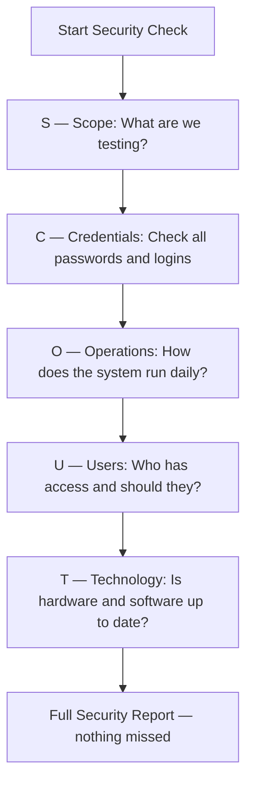

## 🔍 What Is It?

**SCOUT is a checklist that security teams use to make sure they check every corner when looking for weaknesses in a computer system.**

Imagine you're in charge of protecting a school building. You wouldn't just check the front door and call it done. You'd walk around the whole building, check every window, every back door, every room. The SCOUT framework does the same thing for computer systems. It gives security testers five specific areas to check so nothing gets missed.

SCOUT stands for Scope, Credentials, Operations, Users, and Technology. Each letter is a different category of thing to look at when you're trying to find holes in a system's defenses. Security testers — people paid to try to break into systems to find problems before the bad guys do — use this list to stay organized and thorough.

Without a framework like SCOUT, a security tester might forget to check something important, like whether old employee passwords still work or whether the system's software is out of date. SCOUT makes sure every important area gets its own focused check, so the whole picture is covered.

## 🧸 Think Of It Like This

**The New House Safety Check**

Your family just moved into a new house and your parents want to make sure it's safe before you sleep there. First you figure out the Scope — which parts of the house are yours to check (not the neighbor's yard). Then you check Credentials — do any old keys still open your locks, or did the previous owner keep a copy? Next you look at Operations — are the fire alarms working, is the stove left on, are the doors locking properly each night? Then you think about Users — who actually lives here, who has a key, and should anyone's access be taken away? Finally you check Technology — are the smoke detectors up to date, does the security camera system have the latest software? When you finish all five, you can confidently say the house is as safe as you can make it.

## 🖼️ Picture It

<svg viewBox="0 0 600 320" xmlns="http://www.w3.org/2000/svg" font-family="sans-serif">
  <rect width="600" height="320" fill="#f8fafc" rx="12"/>
  <text x="300" y="32" text-anchor="middle" font-size="17" font-weight="bold" fill="#1e293b">SCOUT Framework — Five Areas to Check</text>
  <rect x="20" y="55" width="100" height="60" rx="10" fill="#dbeafe" stroke="#2563eb" stroke-width="2"/>
  <text x="70" y="80" text-anchor="middle" font-size="13" font-weight="bold" fill="#1e40af">S</text>
  <text x="70" y="96" text-anchor="middle" font-size="11" fill="#1e40af">Scope</text>
  <text x="70" y="110" text-anchor="middle" font-size="9" fill="#334155">What are we</text>
  <text x="70" y="121" text-anchor="middle" font-size="9" fill="#334155">testing?</text>
  <rect x="135" y="55" width="100" height="60" rx="10" fill="#dcfce7" stroke="#16a34a" stroke-width="2"/>
  <text x="185" y="80" text-anchor="middle" font-size="13" font-weight="bold" fill="#166534">C</text>
  <text x="185" y="96" text-anchor="middle" font-size="11" fill="#166534">Credentials</text>
  <text x="185" y="110" text-anchor="middle" font-size="9" fill="#334155">Passwords &amp;</text>
  <text x="185" y="121" text-anchor="middle" font-size="9" fill="#334155">logins</text>
  <rect x="250" y="55" width="100" height="60" rx="10" fill="#fef9c3" stroke="#f59e0b" stroke-width="2"/>
  <text x="300" y="80" text-anchor="middle" font-size="13" font-weight="bold" fill="#92400e">O</text>
  <text x="300" y="96" text-anchor="middle" font-size="11" fill="#92400e">Operations</text>
  <text x="300" y="110" text-anchor="middle" font-size="9" fill="#334155">Day-to-day</text>
  <text x="300" y="121" text-anchor="middle" font-size="9" fill="#334155">processes</text>
  <rect x="365" y="55" width="100" height="60" rx="10" fill="#fee2e2" stroke="#ef4444" stroke-width="2"/>
  <text x="415" y="80" text-anchor="middle" font-size="13" font-weight="bold" fill="#991b1b">U</text>
  <text x="415" y="96" text-anchor="middle" font-size="11" fill="#991b1b">Users</text>
  <text x="415" y="110" text-anchor="middle" font-size="9" fill="#334155">Who has</text>
  <text x="415" y="121" text-anchor="middle" font-size="9" fill="#334155">access?</text>
  <rect x="480" y="55" width="100" height="60" rx="10" fill="#ede9fe" stroke="#7c3aed" stroke-width="2"/>
  <text x="530" y="80" text-anchor="middle" font-size="13" font-weight="bold" fill="#4c1d95">T</text>
  <text x="530" y="96" text-anchor="middle" font-size="11" fill="#4c1d95">Technology</text>
  <text x="530" y="110" text-anchor="middle" font-size="9" fill="#334155">Software &amp;</text>
  <text x="530" y="121" text-anchor="middle" font-size="9" fill="#334155">hardware</text>
  <rect x="120" y="145" width="360" height="50" rx="10" fill="#f1f5f9" stroke="#64748b" stroke-width="1.5"/>
  <text x="300" y="165" text-anchor="middle" font-size="12" font-weight="bold" fill="#334155">Security Tester checks each area</text>
  <text x="300" y="183" text-anchor="middle" font-size="11" fill="#64748b">in order — nothing gets skipped</text>
  <line x1="70" y1="115" x2="180" y2="145" stroke="#94a3b8" stroke-width="1.5" stroke-dasharray="4 2"/>
  <line x1="185" y1="115" x2="230" y2="145" stroke="#94a3b8" stroke-width="1.5" stroke-dasharray="4 2"/>
  <line x1="300" y1="115" x2="300" y2="145" stroke="#94a3b8" stroke-width="1.5" stroke-dasharray="4 2"/>
  <line x1="415" y1="115" x2="370" y2="145" stroke="#94a3b8" stroke-width="1.5" stroke-dasharray="4 2"/>
  <line x1="530" y1="115" x2="420" y2="145" stroke="#94a3b8" stroke-width="1.5" stroke-dasharray="4 2"/>
  <rect x="80" y="225" width="440" height="70" rx="10" fill="#e0f2fe" stroke="#2563eb" stroke-width="1.5"/>
  <text x="300" y="248" text-anchor="middle" font-size="12" font-weight="bold" fill="#1e40af">Goal: Full Picture of System Weaknesses</text>
  <text x="300" y="266" text-anchor="middle" font-size="11" fill="#334155">Like checking every door, window, and room</text>
  <text x="300" y="282" text-anchor="middle" font-size="11" fill="#334155">before saying the building is safe</text>
</svg>

## 🔀 How It Breaks Down

## 🌍 Real World Example

A hospital hired a security company to check if patient records were safe. The testers used SCOUT: they defined the Scope (only the hospital's own network), tested Credentials (found 12 old nurse accounts still active after those nurses left), reviewed Operations (discovered patient files were backed up to an insecure server nightly), checked Users (three admin accounts had far more access than needed), and inspected Technology (two medical devices were running software from 2018 with known holes). The hospital fixed all five areas before any real attacker found them.

<svg viewBox="0 0 600 320" xmlns="http://www.w3.org/2000/svg" font-family="sans-serif">
  <rect width="600" height="320" fill="#f8fafc" rx="12"/>
  <text x="300" y="28" text-anchor="middle" font-size="15" font-weight="bold" fill="#1e293b">Hospital Security Check — SCOUT in Action</text>
  <rect x="15" y="45" width="108" height="72" rx="9" fill="#dbeafe" stroke="#2563eb" stroke-width="2"/>
  <text x="69" y="64" text-anchor="middle" font-size="11" font-weight="bold" fill="#1e40af">S — Scope</text>
  <text x="69" y="79" text-anchor="middle" font-size="9" fill="#334155">Hospital's own</text>
  <text x="69" y="91" text-anchor="middle" font-size="9" fill="#334155">network only</text>
  <text x="69" y="106" text-anchor="middle" font-size="9" fill="#64748b">(not neighbors)</text>
  <rect x="135" y="45" width="108" height="72" rx="9" fill="#dcfce7" stroke="#16a34a" stroke-width="2"/>
  <text x="189" y="64" text-anchor="middle" font-size="11" font-weight="bold" fill="#166534">C — Credentials</text>
  <text x="189" y="79" text-anchor="middle" font-size="9" fill="#334155">12 old nurse</text>
  <text x="189" y="91" text-anchor="middle" font-size="9" fill="#334155">accounts still</text>
  <text x="189" y="106" text-anchor="middle" font-size="9" fill="#ef4444">active! ⚠</text>
  <rect x="255" y="45" width="108" height="72" rx="9" fill="#fef9c3" stroke="#f59e0b" stroke-width="2"/>
  <text x="309" y="64" text-anchor="middle" font-size="11" font-weight="bold" fill="#92400e">O — Operations</text>
  <text x="309" y="79" text-anchor="middle" font-size="9" fill="#334155">Nightly backups</text>
  <text x="309" y="91" text-anchor="middle" font-size="9" fill="#334155">go to insecure</text>
  <text x="309" y="106" text-anchor="middle" font-size="9" fill="#ef4444">server! ⚠</text>
  <rect x="375" y="45" width="108" height="72" rx="9" fill="#fee2e2" stroke="#ef4444" stroke-width="2"/>
  <text x="429" y="64" text-anchor="middle" font-size="11" font-weight="bold" fill="#991b1b">U — Users</text>
  <text x="429" y="79" text-anchor="middle" font-size="9" fill="#334155">3 admin accounts</text>
  <text x="429" y="91" text-anchor="middle" font-size="9" fill="#334155">had too much</text>
  <text x="429" y="106" text-anchor="middle" font-size="9" fill="#ef4444">access! ⚠</text>
  <rect x="477" y="45" width="108" height="72" rx="9" fill="#ede9fe" stroke="#7c3aed" stroke-width="2"/>
  <text x="531" y="64" text-anchor="middle" font-size="11" font-weight="bold" fill="#4c1d95">T — Technology</text>
  <text x="531" y="79" text-anchor="middle" font-size="9" fill="#334155">Medical devices</text>
  <text x="531" y="91" text-anchor="middle" font-size="9" fill="#334155">running 2018</text>
  <text x="531" y="106" text-anchor="middle" font-size="9" fill="#ef4444">software! ⚠</text>
  <path d="M69 117 L69 155 L300 155" stroke="#94a3b8" stroke-width="1.5" fill="none" stroke-dasharray="4 2"/>
  <path d="M189 117 L189 145 L300 145" stroke="#94a3b8" stroke-width="1.5" fill="none" stroke-dasharray="4 2"/>
  <line x1="309" y1="117" x2="309" y2="155" stroke="#94a3b8" stroke-width="1.5" stroke-dasharray="4 2"/>
  <path d="M429 117 L429 145 L310 145" stroke="#94a3b8" stroke-width="1.5" fill="none" stroke-dasharray="4 2"/>
  <path d="M531 117 L531 155 L310 155" stroke="#94a3b8" stroke-width="1.5" fill="none" stroke-dasharray="4 2"/>
  <rect x="130" y="160" width="340" height="46" rx="9" fill="#fef2f2" stroke="#ef4444" stroke-width="1.5"/>
  <text x="300" y="180" text-anchor="middle" font-size="12" font-weight="bold" fill="#991b1b">4 problems found across 5 areas</text>
  <text x="300" y="197" text-anchor="middle" font-size="10" fill="#334155">All fixed before a real attacker could exploit them</text>
  <rect x="130" y="225" width="340" height="46" rx="9" fill="#dcfce7" stroke="#16a34a" stroke-width="1.5"/>
  <text x="300" y="245" text-anchor="middle" font-size="12" font-weight="bold" fill="#166534">Patient records now protected ✓</text>
  <text x="300" y="262" text-anchor="middle" font-size="10" fill="#334155">SCOUT gave a complete checklist — nothing was missed</text>
</svg>

## 🎯 Try It Yourself

- AI company data leaks: Big tech companies training AI models hold billions of people's private messages and photos. A SCOUT check would set the Scope (which AI systems touch personal data), test Credentials (who can log in and pull training data), review Operations (how data flows in and out daily), check Users (which engineers have access to raw personal data), and inspect Technology (are the storage systems patched against known attacks).
- Bank mobile apps: As more people move money through phone apps instead of visiting branches, banks are prime targets. SCOUT helps a bank's security team define Scope (the mobile app and its back-end servers), find weak Credentials (old test accounts left open from development), spot Operations risks (transaction logs stored in plain text), review Users (whether too many staff can see customer balances), and check Technology (whether the app runs on libraries with known security holes).
- Electric vehicle charging networks: Charging station companies now manage thousands of connected chargers across highways. A SCOUT review would cover Scope (the charger network and payment system), Credentials (default factory passwords still on devices), Operations (how charger software updates are pushed out), Users (which employees can remotely control chargers), and Technology (whether the chargers' embedded computers can be hijacked to steal payment card data).
- School district cloud tools: After COVID pushed schools fully online, student data sits in dozens of classroom apps. Applying SCOUT means defining Scope (every app the district pays for), checking Credentials (kids often reuse simple passwords, teachers rarely change theirs), reviewing Operations (how student data is shared with third-party apps), auditing Users (whether former students or staff still have active logins), and checking Technology (whether the district's tools have received recent security patches).
